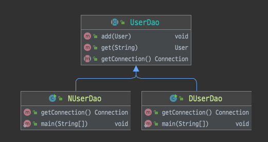

# 1장 오브젝트와 의존관계

스프링은 `자바를 기반`으로 한 기술이다. 그렇기 때문에 가장 중요하게 `가치`를 두는 것이 바로 `객체지향 프로그래밍이 가능한 언어`라는 점이다.

> **스프링의 관심사**

스프링이 가장 `관심`을 많이 두는 대상은 `오브젝트`이다. 애플리케이션에서 오브젝트가 `생성`되고 다른 오브젝트와 `관계를 맺고`, `사용`되고 `소멸`하기까지의 `전 과정`을 진지하게 생각해볼 필요가 있다.

결국 `오브젝트에 대한 관심`은 오브젝트의 `기술적인 특징`과 `사용 방법`을 넘어서 `오브젝트의 설계`로 발전하게 된다.

* 1장에서는 스프링이 어떤 것이고, 무엇을 제공하는지 보다는 스프링이 `관심`을 갖는 대상인 `오브젝트의 설계와 구현`, `동작원리`에 더 집중해야 한다.

## 1.1 초난감 DAO

### 1.1.1 User

사용자 정보를 JDBC API를 통해 DB에 저장하고 조회할 수 있는 DAO를 구현해보기

> **사용자의 정보를 저장하는 User 오브젝트 생성**

```java

@Setter
@Getter
@NoArgsConstructor
public class User {
    private String id;
    private String name;
    private String password;
}
```

* `DAO(Data Access Object)`란 DB를 사용해 데이터를 조회하거나 조작하는 기능을 전담하도록 만든 오브젝트를 말한다.
* `자바 빈(JavaBean)`은 두 가지 관례를 따라 만들어진 오브젝트를 가리킨다.
    * `디폴트 생성자`: 파라미터가 없는 디폴트 생성자를 갖고 있다.
        * 툴이나 프레임워크에서 리플렉션을 이용해 오브젝트를 생성하기 때문에 필요하다.
    * `프로퍼티`: 자바빈이 노출하는 이름을 가진 속성을 프로퍼티라 한다.
        * 프로퍼티는 `set`으로 시작하는 `수정자 메서드(setter)`와 `get`으로 시작하는 `접근자 메서드(getter)`를 이용해 수정 또는 조회가 가능하다.

### 1.1.2 UserDao

사용자의 정보를 DB에 넣고 관리할 수 있는 DAO 클래스 작성하기

> **JDBC를 이용하는 작업의 일반적인 순서**

1. DB 연결을 위한 Connection을 가져온다.
2. SQL을 담은 Statement(또는 PreparedStatement)를 만든다.
3. 만들어진 Statement를 실행한다.
4. 조회의 경우 SQL 쿼리의 실행 결괴를 ResultSet으로 받아서 정보를 저장할 오브젝트(여기서는 User)에 옮겨준다.
5. 작업 중에 생성된 Connection, Statement, ResultSet 같은 리소스는 작업을 마친 후 반드시 닫아준다.
6. JDBC API가 만들어내는 예외 exception를 잡아서 직접 처리하거나, 메소드에 throws를 선언해서 예외가 발생하면 메소드 밖으로 던지게 한다.

> **UserDao**: 새로운 사용자를 생성하는 메서드, 아이디를 가지고 사용자 정보를 읽어오는 메서드

```java
public class UserDao {
    public void add(User user) throws ClassNotFoundException, SQLException {
        Class.forName("com.mysql.cj.jdbc.Driver");
        Connection c = DriverManager.getConnection("jdbc:mysql://localhost:3309/user-db", "root", "1234");

        PreparedStatement ps = c.prepareStatement("INSERT INTO USERS(id, name, password) values (?, ?, ?)");
        ps.setString(1, user.getId());
        ps.setString(2, user.getName());
        ps.setString(3, user.getPassword());

        ps.executeUpdate();

        ps.close();
        c.close();
    }

    public User get(String id) throws SQLException, ClassNotFoundException {
        Class.forName("com.mysql.cj.jdbc.Driver");
        Connection c = DriverManager.getConnection("jdbc:mysql://localhost:3309/user-db", "root", "1234");

        PreparedStatement ps = c.prepareStatement("SELECT * FROM USERS WHERE id = ?");
        ps.setString(1, id);
        ResultSet rs = ps.executeQuery();

        rs.next();

        User user = new User();
        user.setId(rs.getString("id"));
        user.setName(rs.getString("name"));
        user.setPassword(rs.getString("password"));

        rs.close();
        ps.close();
        c.close();

        return user;
    }
}
```

### 1.1.3 main()을 이용한 DAO 테스트 코드

> **여기까지 작성한 내용에 대해서 테스트를 진행**

여기서는 mysql을 [docker-compose](src/main/resources/docker-compose.yml) 를 통해 가상 컨테이너로 올린 뒤에 테스트를 진행하도록 한다.

1. docker-compose up 명령어를 통해 컨테이너를 실행
2. ChapterOneApplication 를 실행 시 schema.sql를 통해 테이블 생성
3. UserDao 테스트 실행

```java
public class UserDao {
    public static void main(String[] args) throws SQLException, ClassNotFoundException {
        UserDao dao = new UserDao();

        User user = new User();
        user.setId("seok_id");
        user.setName("seok");
        user.setPassword("1234");

        dao.add(user);

        System.out.println("등록 성공 : " + user.getId());

        User user2 = dao.get(user.getId());
        System.out.println("사용자 명: " + user2.getName());
        System.out.println("사용자 비밀번호: " + user2.getPassword());

        System.out.println(user2.getId() + " : 조회 성공");
    }
}
```

```text
등록 성공 : seok_id
사용자 명: seok
사용자 비밀번호: 1234
seok_id : 조회 성공
```

* 정상적으로 테스트를 성공하였으나 고민해볼 거리가 있다.

> **테스트에 대한 고민**

만들어진 코드의 기능을 검증하고자 할 때 사용할 수 있는 가장 간단한 방법은 `오브젝트 스스로 자신을 검증`하도록 만들어주는 것이다.

- 테스트는 정상적으로 동작하고 성공하였으나 `객체지향 기술의 원리`에 충실하지 못하였다.

- 그러므로 우리는 이를 개선해야 한다.
    - 동작을 개선해야 하는 이유?
    - 개선하였을 때의 장점?
    - 장점들이 앞으로 어떠한 유익함을 줄 것인가?
    - 객체지향 설계의 원칙과 어떠한 상관이 있을까?
    - DAO를 개선하는 경우와 그대로 사용하는 경우, 스프링을 사용하는 개발에서 무슨 차이가 있을까?

## 1.2 DAO의 분리

### 1.2.1 관심사의 분리

> **객체지향의 세계에 대한 고민**

- 시간에 따라 사용자의 비즈니스 프로세스는 변한다.
- 애플리케이션이 기반을 두고 있는 기술도 변하고, 운영되는 환경도 변한다.

- 개발자가 객체를 설계할 때 가장 염두에 둬야 할 사항이 바로 `미래의 변화를 어떻게 대비`할 것인가이다.

> **객체 지향은 `분리와 확장`을 고려한 설계를 갖기 때문에 변화에 대비할 수 있다.**

- 분리
    - 변화는 대체로 집중된 한 가지 관심에 대해 일어난다.
    - 우리가 준비해야 할 일은 한 가지 관심이 한 군데에 집중되도록 하는 것이다.
    - 이를 `관심사의 분리(Seperation of Concerns)`라 한다.
        - 관심이 같은 것은 하나의 객체 안으로 또는 친한 객체로 모이게 하고, 관심이 다른 것은 가능한 따로 떨어져서 서로 영향을 주지 않도록 분리하는 것이라 생각할 수 있다.

### 1.2.2 커넥션 만들기의 추출

지금까지 작성한 내용 중에 add() 메서드안에 세 가지 관심사항이 존재한다는 것을 발견할 수 있을까?

> **UserDao의 관심사항**

1. **커넥션 연결**
    - DB와 연결을 위한 커넥션을 어떻게 가져올까라는 관심
2. **파라미터 바인딩**
    - 파라미터로 넘어온 사용자 정보를 Statement에 바인딩시키고, Statement에 담긴 SQL을 DB를 통해 실행시키는 관심
3. **리소스 반환**
    - 작업이 끝나면 리소스를 닫아 시스템에 돌려주는 관심

> **핵심 관심사**

DB 연결을 위해 Connection 오브젝트를 가져오는 부분은 필수로 추가되어야 하는 핵심적인 공통 코드라 볼 수 있다.

- 이러한 핵심 관심사를 분리하기 위해 `리펙토링` 하는 방식을 `메서드 추출`이라 한다.
    - 관심 내용이 독립적으로 존재하므로 변경에 대한 수정이 간단해졌다.

* 리펙토링
    - 기존의 코드를 외부의 동작방식에는 변화 없이 내부 구조를 변경해서 재구성하는 작업 또는 기술

```java
public class UserDao {
    public void add(User user) throws ClassNotFoundException, SQLException {
        Connection c = getConnection();
        // ...
    }

    public User get(String id) throws SQLException, ClassNotFoundException {
        Connection c = getConnection();
        // ...
    }

    // 추출된 공통 관심 메서드
    private Connection getConnection() throws SQLException, ClassNotFoundException {
        Class.forName("com.mysql.cj.jdbc.Driver");
        return DriverManager.getConnection("jdbc:mysql://localhost:3309/user-db", "root", "1234");
    }
}
```

### 1.2.3 DB 커넥션 만들기의 독립

> **서비스를 확장하는 방법**

- UserDao에 대한 확장성을 필요로 하는 상황
    - UserDao를 N사와 D사에 사용자 관리 시스템으로 납품하게 되어 각각의 회사에 맞는 DB로 연결할 수 있도록 제공해야 한다.
    - 핵심은 `서로 다른 DB`를 사용하고 있고, 각 회사마다 DB 커넥션을 가져오는 방법 또한 다르다.

> **상속을 통한 확장**

- UserDao 코드를 한 단계 더 분리하는 방식으로 리펙토링한다.
- getConnection()을 추상 메서드로 만들어 놓는다.



> **템플릿 메서드 패턴**

- UserDao 추상 클래스

슈퍼 클래스에 기본적인 로직의 흐름을 만들고, 그 기능의 일부를 추상 메서드나 오버라이딩이 가능한 protected 메서드 등으로 만든 뒤 서브 클래스에서 이런 메서드를 필요에 맞게 구현해서 사용하도록 하는 방법

> **팩토리 메서드 패턴**

- NUserDao, DUserDao

서브 클래스에서 구체적인 오브젝트 생성 방법을 결정하게 하는 것

> **중간 정리**

상위 클래스의 관심사는 Connection 인터페이스 타입의 오브젝트라는 것 외에는 관심을 두지 않는다. 하위 클래스의 관심사는 Connection 오브젝트를 만드는 방법에 대한 관심 만을 갖는다. 하위 클래스들이
모두 같은 종류의 Connection 구현 클래스의 오브젝트를 리턴하되 오브젝트를 생성하는 방식이 다른 경우, 이는 `팩토리 메서드 패턴`이라 이해할 수 있다.

* `중요한건 상속구조를 통해 성격이 다른 관심사항을 분리한 코드를 만들어내고, 서로 영향을 덜 주도록 했는지를 이해하는 것`
* 결국에 지금까지 한 작업을 정리하자면 `UserDao에 팩토리 메서드 패턴을 적용하여 getConnection()을 분리한 작업을 하였다.`라 볼 수 있다.

> **디자인 패턴**

디자인 패턴은 주로 `객체지향 설계`에 관한 것이고, 대부분 객체지향적 설계 원칙을 이용해 문제를 해결한다. 패턴의 설계 구조를 보면 대부분 비슷한데, 그 이유는 객체지향적인 설계로부터 문제를 해결하기 위해 적용할
수 있는 `확장성 추구 방법`이 대부분 `두 가지 구조(상속과 오브젝트 합성)`로 정리되기 때문이다. 핵심은 `패턴이 갖는 목적 또는 의도`이다. 패턴을 적용해야 하는 `상황`, `해결해야 하는 문제`,
솔루션의 `구조`와 `각 요소의 역할`과 함께 핵심 의도가 무엇인지를 기억해야 한다.


> **템플릿 메서드 패턴**

상속을 통해 슈퍼 클래스의 기능을 확장할 때 사용하는 방법

- `변하지 않는 기능`은 `슈퍼클래스`에 만들어두고, `자주 변경되며 확장할 기능`은 `서브 클래스`에서 만들도록 한다.
- 슈퍼 클래스에서는 미리 추상 메서드 또는 오버라이드 가능한 메서드를 정의하고, 이를 활용해 코드의 기본 알고리즘을 담고 있는 `템플릿 메서드`를 만든다.

* 슈퍼클래스에서 디폴트 기능을 정의 해두거나 비워뒀다가 서브클래스에서 선택적으로 오버라이드할 수 있도록 만들어둔 메소드를 `훅(hook)` 메소드라고 한다.

> **팩토리 메서드 패턴**

`팩토리 메서드 패턴`도 `템플릿 메서드 패턴`과 마찬가지로 `상속`을 통해 기능을 확장하게 하는 패턴이다. 슈퍼클래스 코드에서는 서브클래스에서 구현할 메서드를 호출해서 필요한 타입의 오브젝트를 가져와 사용한다.

서브클래스에서 오브젝트 생성 방법과 클래스를 결정할 수 있도록 미리 정의해둔 메소드를 `팩토리 메소드`라고 하고， 이 방식을 통해 오브젝트 생성 방법을 나머지 로직, 즉 슈퍼클래스의 기본 코드에서 독립시키는
방법을 `팩토리 메소드 패턴` 이라고 한다

* 자바에서는 종종 오브젝트를 생성하는 기능을 가진 메소드를 일반적으로 `팩토리 메소드`라고 부르기도 하지만 의미가 다르다.

> **상속의 문제점**

상속의 문제점은 다중상속을 허용하지 않는다는 문제점이 있다. 이는 후에 다른 목적으로 UserDao에 상속을 적용하기 힘들다.

또 다른 문제점은 상속을 통한 상하위 클래스의 관계는 생각보다 밀접하다.
`상속`을 통해 `관심이 다른 기능을 분리`하고, 필요에 따라 다양한 변신이 가능하도록 확장성도 줬지만 여전히 `상속관계`는 두 가지 다른 관심사에 대한 긴밀한 결합을 허용한다.
이는 `슈퍼클래스에 변경사항이 일어나는 경우` 서브 클래스를 함께 수정하거나 다시 개발해야 하는 문제를 발생시킬 수 있다.

