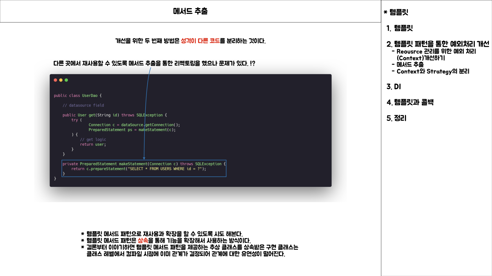
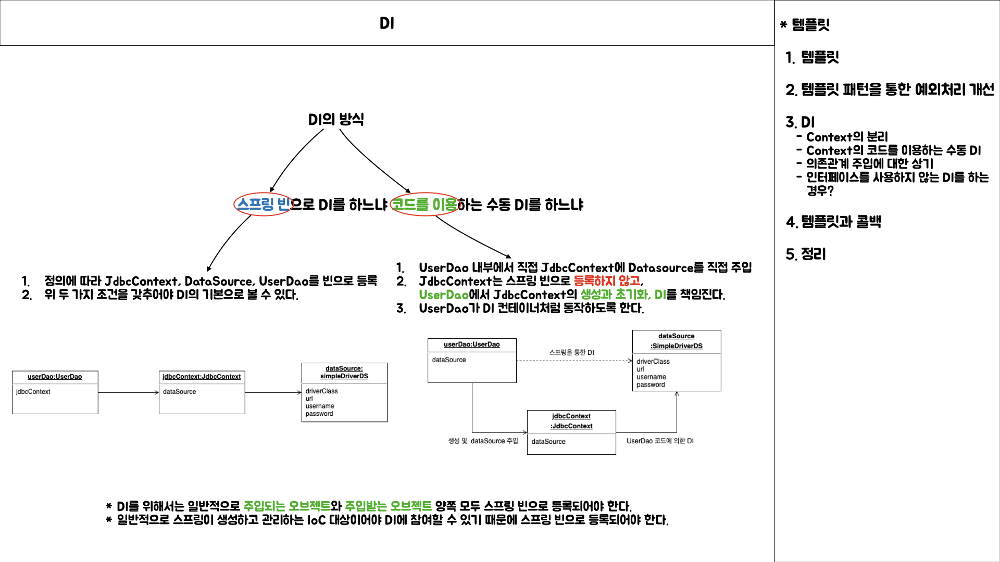
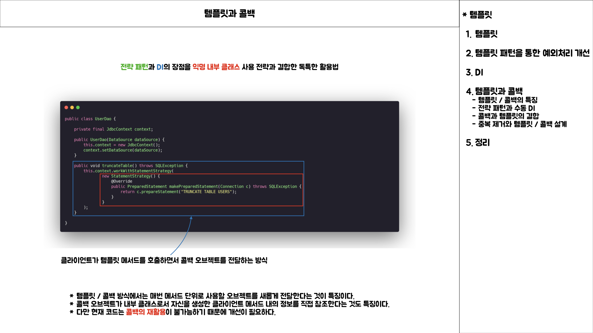

# 3장 템플릿

## 템플릿

- 템플릿이라는 개념을 현재 코드에 적용하기 위한 생각하기
    - 템플릿을 적용하기 위해서는 컨텍스트와 전략에 속하는 코드를 구분할 줄 알아야 한다.
    - 컨텍스트와 전략을 구분하고 클래스 간의 관계를 설정할 때 DI를 사용한다.
    - 클라이언트와 템플릿, 전략 패턴 간의 클래스를 구성하는 방식은 템플릿 / 콜백의 설계 방식으로 볼 수 있다.

### 템플릿

- 템플릿의 개념은 어떠한 부분에 관심을 갖고 있을까?
  - 템플릿도 추구하는 바는 OCP이다.
  - 확장에는 열려 있다는 개념에는 전략 패턴을 적용, 변경에는 닫혀 있다는 개념에는 컨텍스트로 정의한다.
  - 결국, 변경 가능성이 적은 코드와 다양한 기능을 제공할 가능성이 높은 코드를 구분할 줄 아는 것이 중요하다.

### 템플릿 패턴을 통한 예외처리 개선

> 성격이 다른 코드를 찾아내는 것

> 성격이 다른 코드를 잘 분리하는 것

> 다양한 기능을 제공하는 코드를 전략 패턴으로 구성하는 것

> 컨텍스트를 메서드로 분리 및 전략 패턴의 적용

### 확장을 위한 의존성 주입

> 컨텍스트를 공통 클래스로 구현로 구현, 전략 패턴을 익명 내부 클래스로 구현

> 컨텍스트와 전략 패턴으로 설계와 DI의 방식을 정의하기

> UserDao에서 JdbcContext의 팩토리와 DI 역할을 위임하기

> DI의 정석적인 정의와 `특이 케이스`에 대한 DI

### 템플릿과 콜백

> 템플릿과 콜백의 동작방식 이해

> 템플릿과 콜백의 동작방식 적용

> 템플릿 / 콜백의 동작방식 확인

> 최종적으로 구현된 템플릿 / 콜백 패턴을 갖는 JdbcContext 클래스

### 정리

