# 6. AOP

날짜: 2021년 12월 6일 → 2021년 12월 19일 속성: SR 주제: 6장 키워드: AOP, 관점 지향 프로그래밍

# AOP

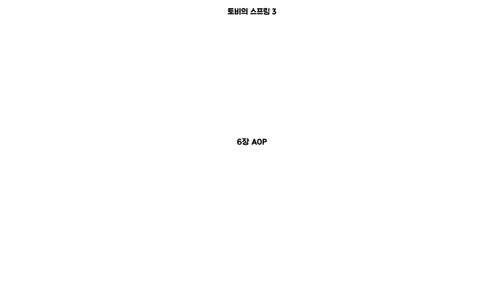

## Intro

관점 지향 프로그래밍에 대한 내용을 이해해본다.

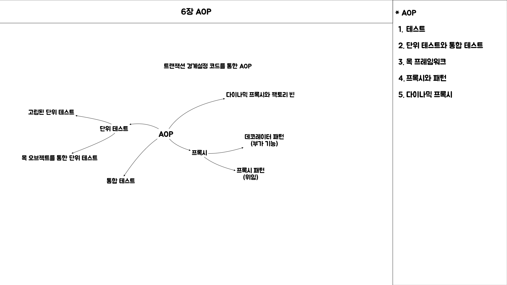

### 단위 테스트 (고립된 테스트)

> **기존에 작성했던 코드의 기능에 대해 AOP로 분리할 수 있는 부분을 확인**

- 테스트 대상의 의존 오브젝트를 파악하여 **`테스트 해야 하는 성격을 분리`**해본다.
- UserService의 기능이 동작하기 위해서 `**세 가지 기능**`이 필요하다.
    - `**데이터 접근**`에 필요한 로직인 UserDao
    - 서비스 레이어에서 DBMS의 `**트랜잭션의 관리**`를 위한 TransactionManager
    - **`메일 발송`**을 위한 MailSender

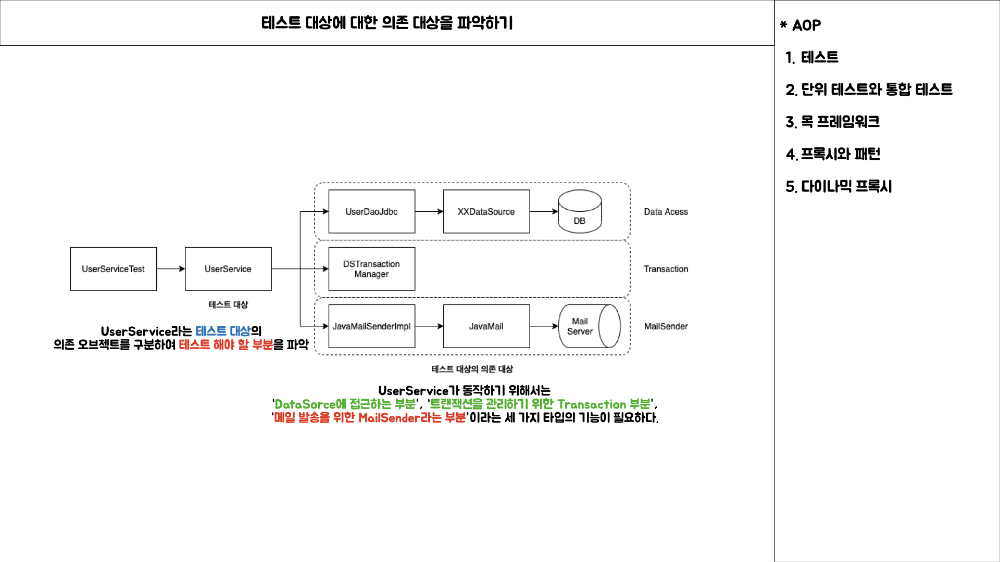

> **테스트 대상의 의존성을 최대한 줄이기 위한 목 오브젝트**

- MockMailSender라는 목 오브젝트를 통해 메일 발송 테스트하는 경우

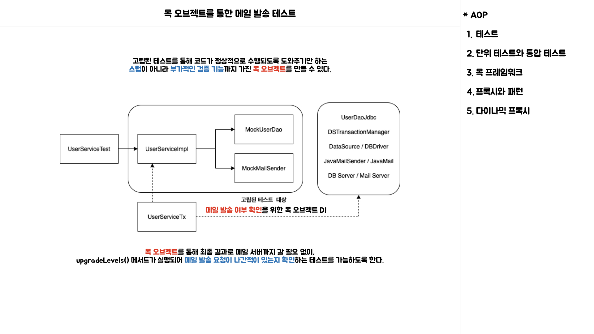

- MockUserDao라는 목 오브젝트를 통해 데이터 수정 테스트 하는 경우

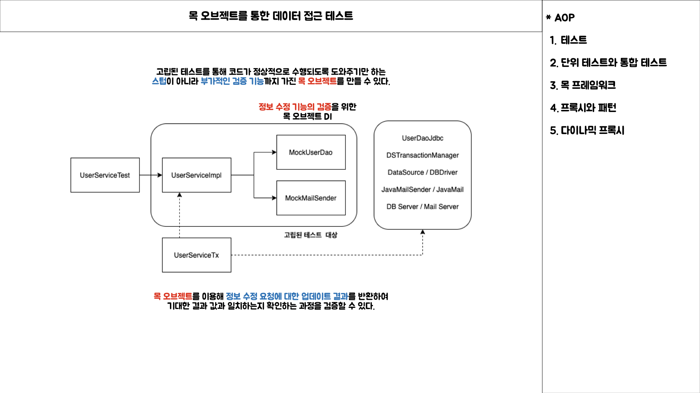

### 단위 테스트와 통합 테스트

단위 테스트와 통합 테스트를 작성하는 목적과 방식에 대해서 주의 깊게 살펴보아야 한다.

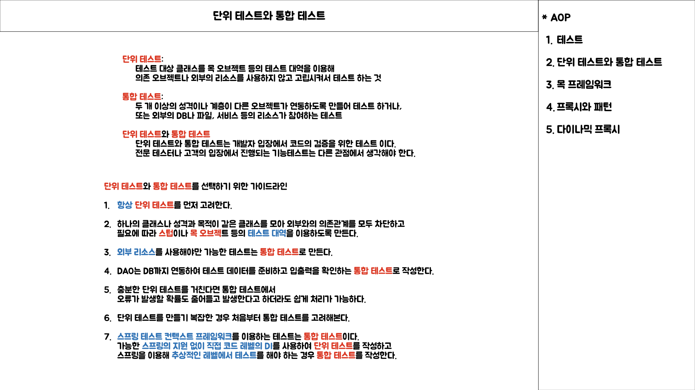

> **통합 테스트를 단위 테스트로 작성을 돕는 목 프레임워크**

- 두 가지 이상의 성격을 갖는 코드를 테스트 하기 위해서는 필히 통합 테스트로 작성해야 하나 목 프레임워크를 통해 단위 테스트로 작성할 수 있다.

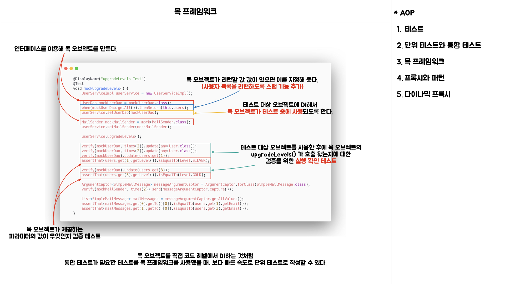

### 프록시와 패턴

> **프록시와 사용 목적에 따른 패턴구분**

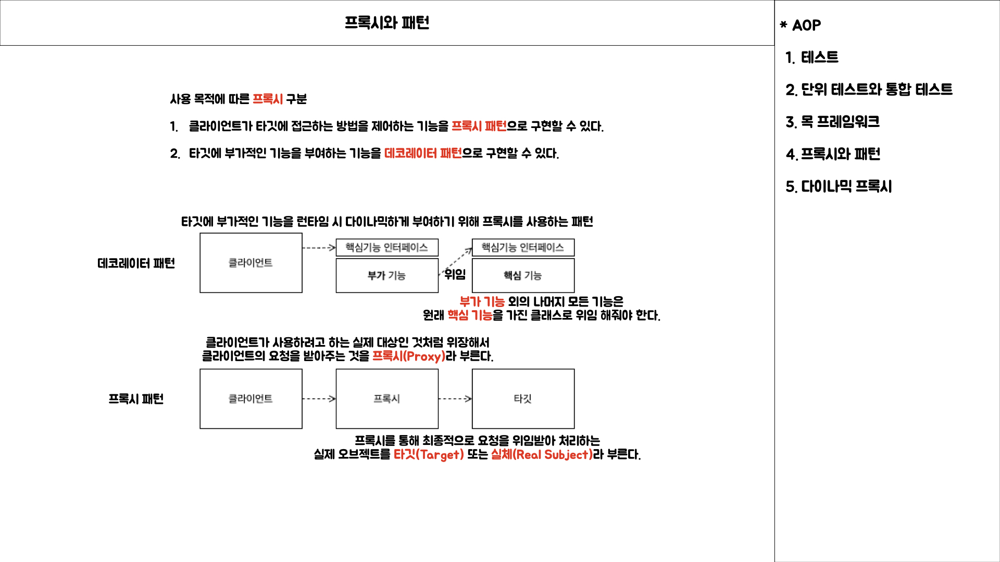

> **다이나믹 프록시**

- 기본적인 다이나믹 프록시의 동작방식

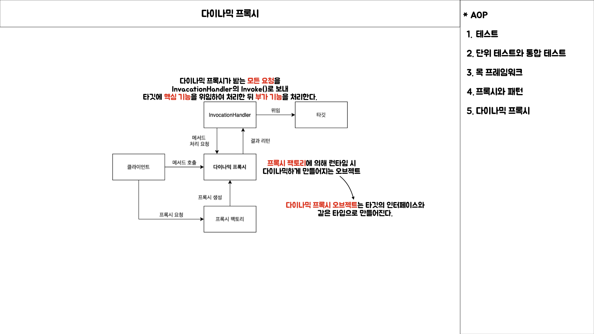

- 다이나믹 프록시 생성

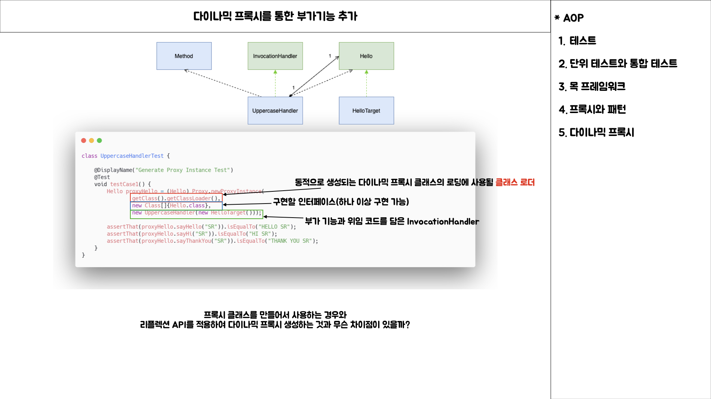

- JDK 다이나믹 프록시와 스프링 ProxyFactoryBean의 구분

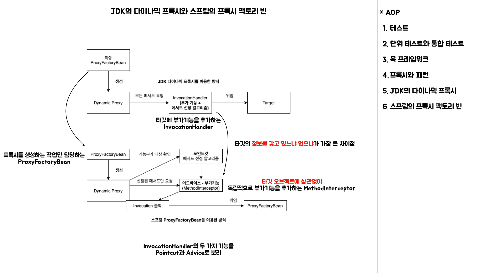

### 6.9 정리

> 책 읽은 척하기

**트랜잭션 경계설정 기능**을 성격이 다른 **비즈니스 로직 클래스**에서 분리하여 적용할 수 있는 방법을 찾아 보면서 최종적으로는 모듈화할 수 있는 AOP 기술을 통해 해결하였다.

> 6장에서 무엇을 했고 어떤 부분을 정리했는지 살펴보기

- **트랜잭션 경계설정 코드**를 분리해서 별도의 클래스를 만들고 **비즈니스 로직 클래스**와 동일한 인터페이스를 구현하면 DI의 확장기능을 이용해 클라이언트의 변경없이 깔끔하게 분리된 트랜잭션 **부가기능**을
  만들 수 있다.
    - `데코레이터 패턴` 및 `프록시 패턴`을 통해 트랜잭션 기능을 적용하는 방식으로 앞에서 설명되었다.
- 트랜잭션처럼 환경과 외부 리소스에 영향을 받는 코드를 분리하면 `비즈니스 로직에만 충실한 테스트`를 만들 수 있다.
- **목 오브젝트**를 활용하면 의존관계 속에 있는 오브젝트도 손쉽게 **고립된 테스트**로 만들 수 있다.
- `DI를 이용한 트랜잭션의 분리`는 `데코레이터 패턴`과 `프록시 패턴`으로 이해될 수 있다.
- 번거로운 프록시 클래스 작성은 **JDK의 다이내믹 프록시**를 사용하면 간단하게 만들 수 있다.
- **다이내믹 프록시**는 **스태틱 팩토리 메소드**를 사용하기 때문에 빈으로 등록하기 번거롭다. 따라서 **팩토리 빈**으로 만들어야 한다. 스프링은 자동 프록시 생성 기술에 대한 추상화 서비스를 제공하는 **
  프록시 팩토리 빈(ProxyFactoryBean)**을 제공한다.
- **프록시 팩토리 빈**의 설정이 반복되는 문제를 해결하기 위해 **자동 프록시 생성기**와 **포인트컷** 을 활용할 수 있다. 자동 프록시 생성기는 부가기능이 담긴 어드바이스를 제공하는 프록시를 스프링
  컨테이너 초기화 시점에 자동으로 만들어준다.
- 포인트컷은 AspectJ 포인트컷 표현식을 사용해서 작성하면 펀리하다.
- **AOP**는 **OOP**만으로는 모듈화하기 힘든 부가기능을 효과적으로 모듈화하도록 도와주는 기 술이다.
- 스프링은 자주 사용되는 AOP 설정과 **트랜잭션** 속성을 지정하는 데 사용할 수 있는 **전용 태 그**를 제공한다.
- **AOP**를 이용해 **트랜잭션 속성을 지정하는 방법**에는 포인트컷 표현식과 메소드 이름 패턴 을 이용하는 방법과 타깃에 직접 부여하는 @Transactional 애노테이션을 사용하는 방법이 있다.
- **@Transactional**을 이용한 트랜잭션 속성을 테스트에 적용하면 손쉽게 DB를 사용하는 코드의 테스트를 만들 수 있다.
