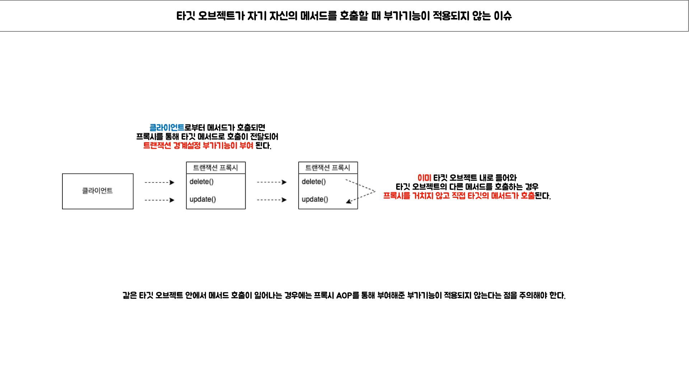
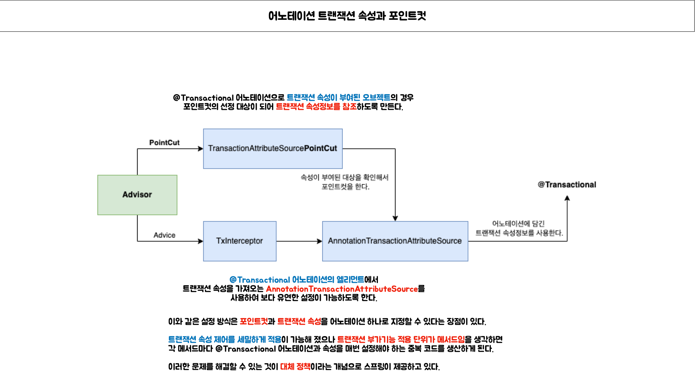

# 6. AOP

날짜: 2021년 12월 6일 → 2021년 12월 19일 속성: SR 주제: 6장 키워드: AOP, 관점 지향 프로그래밍

# AOP


## Intro

관점 지향 프로그래밍에 대한 내용을 이해해본다.


### 단위 테스트 (고립된 테스트)

> **기존에 작성했던 코드의 기능에 대해 AOP로 분리할 수 있는 부분을 확인**

- 테스트 대상의 의존 오브젝트를 파악하여 **`테스트 해야 하는 성격을 분리`**해본다.
- UserService의 기능이 동작하기 위해서 `**세 가지 기능**`이 필요하다.
    - `**데이터 접근**`에 필요한 로직인 UserDao
    - 서비스 레이어에서 DBMS의 `**트랜잭션의 관리**`를 위한 TransactionManager
    - **`메일 발송`**을 위한 MailSender


> **테스트 대상의 의존성을 최대한 줄이기 위한 목 오브젝트**

- MockMailSender라는 목 오브젝트를 통해 메일 발송 테스트하는 경우


- MockUserDao라는 목 오브젝트를 통해 데이터 수정 테스트 하는 경우


### 단위 테스트와 통합 테스트

단위 테스트와 통합 테스트를 작성하는 목적과 방식에 대해서 주의 깊게 살펴보아야 한다.


> **통합 테스트를 단위 테스트로 작성을 돕는 목 프레임워크**

- 두 가지 이상의 성격을 갖는 코드를 테스트 하기 위해서는 필히 통합 테스트로 작성해야 하나 목 프레임워크를 통해 단위 테스트로 작성할 수 있다.


## 6.3 다이나믹 프록시와 팩토리 빈

### 6.3.1 프록시와 프록시 패턴, 데코레이터 패턴

> **프록시와 사용 목적에 따른 패턴구분**


### 6.3.2 다이나믹 프록시

> **다이나믹 프록시**

- 기본적인 다이나믹 프록시의 동작방식


- 다이나믹 프록시 생성


## 6.4 스프링 프록시 팩토리 빈

### 6.4.1 ProxyFactoryBean

- JDK 다이나믹 프록시와 스프링 ProxyFactoryBean의 구분


## 6.5 스프링 AOP

### 6.5.6 AOP의 용어

> 타깃

타깃은 **부가기능**을 부여할 대상이다.

`**핵심기능**`을 담은 클래스일 수도 있지만 경우에 따라 다른 **`부가기능`**을 제공하는 프록시 오브젝트일 수 있다.

> 어드바이스

타깃에게 제공할 부가기능을 담은 모듈이다.

어드바이스는 오브젝트로 정의하기도 하지만 메서드 레벨에서 정의할 수도 있다.

어드바이스의 종류는 MethodInterceptor처럼 메서드 호출 과정에 전반적으로 참여하는 것도 있지만, 예외가 발생했을 때만 동작하는 어드바이스처럼 메서드 호출 과정의 일부에서만 동작하는 어드바이스도 있다.

> 조인 포인트

조인 포인트란 어드바이스가 적용될 수있는 위치를 말한다.

스프링의 프록시 AOP에서 조인 포인트는 메서드의 실행 단계뿐이다.

타깃 오브젝트가 구현한 인터페이스의 모든 메서드는 조인 포인트가 된다.

> 포인트컷

포인트컷이란 어드바이스를 적용할 조인 포인트를 선별하는 작업 또는 그 기능을 정의한 모률을 말한다.

스프링 AOP의 조인 포인트는 메소드의 실행이므로 스프링의 포인트컷은 메소드를 선정하는 기능을 갖고 있다.

포인트컷 표현식은 메소드의 실행이라는 의미인 execution으로 시작하고, 메소드의 시그니처를 비교하는 방법을 주로 이용한다.

메소드는 클래스 안에 존재하는 것이기 때문에 메소드 선정이란 결국 클래스를 선정하고 그 안의 메소드를 선정하는 과정을 거치게 된다.

> 프록시

프록시는 클라이언트와 타깃 사이에 투명하게 존재하면서 부가기능을 제공하는 오브젝트다.

DI를 통해 타깃 대신 클라이언트에게 주입되며 클라이언트의 메소드 호출을 대신 받아서 타깃에 위임해주면서, 그 과정에서 부가기능을 부여한다.

스프링은 프록시를 이용해 AOP를 지원한다.

> 어드바이저

어드바이저는 포인트컷과 어드바이스를 하나씩 갖고 있는 오브젝트다.

어드바이저는 어떤 부가기능(어드바이스)을 어디에(포인트컷) 전달할 것인가를 알고 있는 AOP의 가장 기본이 되는 모듈이다.

스프링은 `자동 프록시 생성기`가 어드바이저를 AOP 작업의 정보로 활용한다.

어드바이저는 스프링 AOP에서만 사용되는 특별한 용어이고, 일반적인 AOP에서는사용되지 않는다.

> 애스펙트

OOP의 클래스와 마찬가지로 애스펙트는 AOP의 기본 모듈이다.

한 개 또는 그 이상 의 포인트컷과 어드바이스의 조합으로 만들어지며 보통 싱글톤 형태의 오브젝트로 존재한다.

따라서 클래스와 같은 모듈 정의와 오브젝트와 같은 실체(인스턴스)의 구분이 특별히 없다. 두 가지 모두 애스펙트라고 불린다.

스프링의 어드바이저는 아주 단순한 애스펙트라고 볼 수도 있다.

### 6.5.7 AOP 네임스페이스

스프링의 프록시 방식 AOP

- 자동 프록시 생성기

스프링의 DefaultAdvisorAutoProxyCreator 클래스를 빈으로 등록한다.

다른 빈을 DI 하지도 않고 자신도 DI 되지 않으며 독립적으로 존재한다.

애플리케이션 컨텍스트가 빈 오브젝트를 생성하는 과정에 빈 후처리기 로 참여한다.

빈으로 등록된 어드바이저를 이용해서 프록시를 자동으로 생성하는 기능을 담당한다.

- 어드바이스

부가기능을 구현한 클래스를 빈으로 등록한다.

TransactionAdvice는 AOP 관련 빈 중에서 유일하게 직접 구현한 클래스를 사용한다.

- 포인트컷

스프링의 AspectJExpressionPointcut을 빈으로 등록하고 expression 프로퍼티에 포인트컷 표현식을 넣어주면 된다.

- 어드바이저

스프링의 DefaultPointcutAdvisor 클래스를 빈으로 등록해서 사용한다.

어드바이스와 포인트컷을 프로퍼티로 참조히는 것 외에는 기능은 없다.

자동 프록시 생성기에 의해 자동 검색되어 사용된다.

어드바이스를 제외한 나머지 클래스는 스프링이 제공하는 클래스를 빈으로 등록하고 프로퍼티 등록만 하면 사용이 가능하다.

## 6.6 트랜잭션 속성

현재 챕터는 트랜잭션과 AOP의 기능인 어드바이스, 포인트컷 또는 어드바이저에 대한 지식이 있어야 이해가 쉽다.

`트랜잭션 매니저`에서 트랜잭션을 가져올 때 `DefaultTransactionDefinition` 오브젝트를 사용한다.

TransactionAdvice의 트랜잭션 경계설정 코드를 확인해 본다.

```java
public class TransactionAdvice implements MethodInterceptor {

    private PlatformTransactionManager transactionManager;

    public void setTransactionManager(PlatformTransactionManager transactionManager) {
        this.transactionManager = transactionManager;
    }

    @Override
    public Object invoke(MethodInvocation invocation) throws Throwable {
        TransactionStatus transactionStatus = this.transactionManager.getTransaction(new DefaultTransactionDefinition());
        try {
            Object ret = invocation.proceed();
            this.transactionManager.commit(transactionStatus);
            return ret;
        } catch (RuntimeException e) {
            this.transactionManager.rollback(transactionStatus);
            throw e;
        }
    }
}
```

`트랜잭션의 경계`는 트랜잭션 매니저에서 트랜잭션을 가져오는 것과 `commit()`, `rollback()` 중의 하나를 호출하는 것으로 설정되고 있다.

- 트랜잭션을 가져올 때 파라미터로 `트랜잭션 매니저`에게 전달하는 `DefaultTransactionDefinition` 용도가 무엇일까?

### 6.6.1 트랜잭션 정의

트랜잭션이라고 모두 같은 방식으로 동작하는 것은 아니다.

트랜잭션 경계 안에서 진행된 작업은 commit()을 통해 모두 성공하든지 아니면 rollback()을 통해 모두 취소되어야 한다.

트랜잭션의 동작방식을 제어할 수 있는 몇 가지 조건이 있다.

DefaultTransactionDefinition이 구현하고 있는 TransactionDefinition 인터페이스는 트랜잭션의 동작방식에 영향을 줄 수 있는 네 가지 속성을 정의하고 있다.

> 트랜잭션 전파

- 트랜잭션 전파(transaction propagation)란
    - 트랜잭션의 경계에서 이미 진행 중인 트랜잭션이 있을 때 또는 없을 때 어떻게 동작할 것인가를 결정하는 방식을 말한다.

- PROPAGATION_REQUIRED

가장 많이 사용되는 `DefaultTransactionDefinition`의 트랜잭션 전파 속성이다.

진행 중인 트랜잭션이 없으면 새로 시작하고, 이미 시작된 트랜잭션이 있으면 이에 참여 한다.

이 트랜잭션 전파 속성을 갖는 코드는 다양한 방식으로 결합해서 하나의 트랜잭션으로 구성하기 쉽다.

A와 B가 모두 PROPAGATION_REQUIRED로 선언되어 있다면, A, B, A → B, B → A와 같은 네 가지의 조합된 트랜잭션이 모두 가능하다.

- PROPAGATION_REQUIRES_NEW

항상 새로운 트랜잭션을 시작하는 전파 속성으로 앞에서 시작된 트랜잭션이 있든 없든 상관없이 새로운 트랜잭션을 만들어서 독자적으로 동작하게 한다.

독립적인 트랜잭션이 보장되어야 하는 코드에 적용할 수 있다.

- PROPAGATION_NOT_SUPPORTED

트랜잭션 없이 동작하도록 하는 트랜잭션 전파 속성으로 진행 중인 트랜잭션이 있어도 무시한다.

트랜잭션 없이 동작해야 하는 상황은 보통 트랜잭션 경계설정을 AOP를 이용해 한 번에 많은 메서드에 동시에 적용하게 되는데, 특정 메서드의 트랜잭션 전파 속성만 PROPAGATION_NOT_SUPPORTED로
설정하여 트랜잭션이 적용되지 않도록 할 수 있다.

전파 속성에 대한 정리를 해보면

트랜잭션 매니저를 통해 트랜잭션을 시작하려고 할 때 getTransaction()이라는 메서드를 사용하는 이유는 트랜잭션 전파 속성이 있기 때문이다.

트랜잭션 전파 속성과 현재 진행 중인 트랜잭션이 존재하는지 여부에 따라 동작 방식을 다르게 할 수 있다.

트랜잭션 전파 속성과 현재 진행 중인 트랜잭션이 존재하는지 여부에 따라서 새로운 트랜잭션을 시작할 수도 있고, 이미 진행중인 트랜잭션에 참여하기만 할 수도 있다.

진행 중인 트랜잭션에 참여하는 경우 트랜잭션 경계의 끝에서 트랜잭션을 커밋시키지도 않는다. 최초로 트랜잭션을 시작한 경계까지 정상적으로 진행되어야 비로소 커밋될 수 있다.

> 격리수준

모든 DB는 트랜잭션 격리수준(isolation level)을 갖고 있어야 한다.

기능하다면 모든 트랜잭션이 순차적으로 진행되어 다른 트랜잭션의 작업에 독립적인 것이 좋겠지만 그러자면 성능이 크게 떨어질 수 밖에 없다.

적절하게 격리수준을 조정해서 가능한 한 많은 트랜잭션을 동시에 진행시키면서도 문제가 발생하지 않게 하는 제어가 필요하다.

격리수준은 기본적으로 DB에 설정되어 있지만 JDBC 드라이버나 DataSource 등에서 재설정할수 있고, 필요하다면 트랜잭션 단위로 격리 수준을 조정할 수 있다.

> 제한시간

트랜잭션을 수행하는 `제한시간`을 설정할 수 있다. DefaultTransactionDefinition의 기본 설정은 `제한시간이 없는 것`이다.

제한시간은 트랜잭션을 직접 시작할 수 있는 `PROPAGATION_REQUIRED`나 `PROPAGATION_REQUIRES_NEW` 와 함께 사용해야 만 의미가 있다.

> 읽기전용

읽기전용(readOnly)으로 설정해두면 트랜잭션 내에서 데이터를 조작하는 시도를 막아줄 수 있을 뿐더러 일부 데이터 액세스 기술에 따라서는 성능면에서 향상시킬 수도 있다.

TransactionDefinition 타입 오브젝트를 사용하면 네 가지 속성을 이용해 트랜잭션의 동작방식을 제어할 수 있다.

TransactionAdvice는 트랜잭션 경계설정 기능을 갖고 있으며 TransactionDefinition 오브젝트를 생성하고 사용할 수 있다.

디폴트 속성 외에 다른 속성을 사용하려면 외부에서 정의된 TransactionDefinition 오브젝트를 DI 받아서 사용하면 된다.

여기 까지 내용으로는 트랜잭션 속성을 변경하면 TransactionAdvice를 사용하는 모든 트랜잭션의 속성이 한번에 바뀌는 문제가 있다.

고민해 볼 것은 원하는 메서드만 선택하여 독자적인 트랜잭션 정의를 정의할 방법을 찾아야 한다.

### 6.6.2 트랜잭션 인터셉터와 트랜잭션 속성

메소드별로 다른 트랜잭션 정의를 적용하려면 어드바이스의 기능을 확장해야 한다.

> TransactionInterceptor

기존에 만들었던 TransactionAdvice를 다시 설계할 필요는 없이 TransactionInterceptor를 통해 트랜잭션 경계설정 어드바이스를 사용할 수 있다.

TransactionInterceptor 어드바이스의 동작방식은 TransactionAdvice와 다르지 않고, 다만 트랜잭션 정의를 메소드 이름 패턴을 이용해서 다르게 지정할 수 있는 방법을 추가로 제공해준다.

TransactionInterceptor는 PlatformTransactionManager와 Properties 타입의 두 가지 프로퍼티를 갖고 있다.

Properties 타입인 두 번째 프로퍼티 이름은 transactionAttributes로, 트랜잭션 속성을 정의한 프로퍼티다.

트랜잭션 속성은 TransactionDefinition의 네 가지 기본 항목에 rollbackOn()이라는 메소드를 하나 더 갖고 있는 TransactionAttribute 인터페이스로 정의된다.

rollbackOn() 메소드는 어떤 예외가 발생하면 롤백을 할 것인가를 결정하는 메소드다.

TransactionAttribute를 이용하면 트랜잭션 부가기능의 동작 방식을 모두 제어할 수 있다.

TransactionAdvice 트랜잭션 경계설정 코드를 다시 살펴보면 트랜잭션 부가기능의 동작방식을 변경할 수 있는 곳이 두 군데 있다는 사실을 알 수 었다.

```java
public class TransactionAdvice implements MethodInterceptor {

    private PlatformTransactionManager transactionManager;

    public void setTransactionManager(PlatformTransactionManager transactionManager) {
        this.transactionManager = transactionManager;
    }

    @Override
    public Object invoke(MethodInvocation invocation) throws Throwable {
        TransactionStatus transactionStatus = this.transactionManager.getTransaction(
                // 트랜잭션 정의를 통한 네 가지 조건
                new DefaultTransactionDefinition());
        try {
            Object ret = invocation.proceed();
            this.transactionManager.commit(transactionStatus);
            return ret;
        } catch (RuntimeException e) { // 롤백 대상인 예외 종류
            this.transactionManager.rollback(transactionStatus);
            throw e;
        }
    }
}
```

주석의 두 가지 항목이 결합되어 트랜잭션 부가기능의 행동을 결정하는 TransactionAttribute 속성이 된다.

TransactionAdvice는 RuntimeException이 발생하는 경우에만 트랜잭션을 롤백시킨다.

하지만 런타임 예외가 아닌 경우 트랜잭션이 제대로 처리되지 않고 메서드를 빠져나가게 되어 있다.

문제가 되는 상황은 체크 예외를 던지는 타깃에 TransactionAdvice를 사용하는 경우 런타임 예외가 아니기 때문에 트랜잭션이 제대로 처리되지 않는다는 것이다.

하지만 모든 일은 정해진대로 되는 법이 없고, 비즈니스 로직상의 예외 경우를 나타내기 위해서 타킷 오브젝트가 체크 예외를 던지는 경우에 트랜잭션이 올바로 동작하는 것을 기대하기도 한다.

- TransactionInterceptor의 두 가지 종류의 `예외 처리 방식`

`런타임이 발생`하면 트랜잭션은 롤백이 된다.

반면 타깃 메서드가 런타임 예외가 아닌 `체크 예외가 발생`하면 이것을 예외 상황으로 해석하지 않고 일종의 비즈니스 로직에 따른, 의미가 있는 리턴 방식의 한 가지로 인식해서 트랜잭션을 커밋해버린다.

`스프링의 기본 예외처리 원칙`에 따라 비즈니스적인 의미가 있는 예외상황에만 `체크예외`를 사용하고, 그 외의 모든 복구 불가능한 순수한 예외의 경우 `런타임 예외`로 포장하여 전달하는 방식에 따른 것이다.

TransactionInterceptor는 이러한 예외처리 기본 원칙의 변칙적인 경우에 대해서 TransactionAttribute는 `rollbackOn()`이라는 속성을 통해 기본 원칙에서 벗어나는 다른
예외처리를 가능하도록 한다.

> 메서드 이름 패턴을 이용한 트랜잭션 속성 지정

Properties 타입의 transactionAttributes 프로퍼티는 메서드 패턴과 트랜잭션 속성을 키와 값으로 갖는 컬렉션이다.

```text
PROPAGATION_NAME,ISOLATION_NAME,readOnly,timeout_NNNN,-Exception1,+Exception2
```

- PROPAGATION`_NAME`
    - 트랜잭션 전파 방식, `필수항목`으로 PROPAGATION_으로 시작한다.
- ISOLATION`_NAME`
    - 격리수준, ISOLATION_으로 시작하며 `생략이 가능`하다.
    - 생략되면 디폴트 격리 수준으로 지정한다.
- readOnly
    - 읽기전용 항목으로 `생략이 가능`하다.
    - 기본 값은 읽기전용이 아니다.
    - 트랜잭션이 처음 시작할 때만 적용
- timeout_NNNN
    - 제한시간 설정으로 timeout_으로 시작하고 초 단위 시간을 뒤에 붙인다.
    - `생략이 가능`하다.
    - 트랜잭션이 처음 시작할 때만 적용
- -Exception1
    - `체크 예외` 중에서 롤백 대상을 추가할 것을 넣는다.
    - 한 개 이상을 등록할 수 있다.
- +Exception2
    - `런 타임 예외`지만 롤백시키지 않을 예외들을 넣는다.
    - 한 개 이상을 등록할 수 있다.

트랜잭션 속성 정의 예

- get으로 시작하는 모든 메서드에 대한 속성을 `PROPAGATION_REQUIRED`, `readOnly`, `timeout`은 30초
    - 일반적으로 읽기전용 메서드는 get 또는 find 같은 규칙의 이름으로 시작한다.
    - 조회용 메서드의 트랜잭션은 읽기전용으로 설정하여 성능향상을 기대할 수 있다.
    - 여기서 readOnly나 timeout 등은 트랜잭션이 처음 시작될 때가 아니라면 적용되지 않는다.
    - 따라서 get으로 시작하는 메서드에서 트랜잭션을 시작하는 경우 `읽기전용에 제한시간이 적용`되지만 그 외에 경우에는 `진행중인 트랜잭션의 속성을 따르게 되어 있다.`
- upgrade로 시작하는 모든 메서드는 `PROPAGATION_REQUIRES_NEW`, `ISOLATION_SERIALIZABLE` 설정
    - 항상 독립적인 트랜잭션으로 동작하도록 트랜잭션 전파 항목을 `PROPAGATION_REQUIRES_NEW`로 설정한다.
    - 다른 동시 작업에 영향을 받지 않도록 완벽하게 고립된 상태에서 트랜잭션이 동작하도록 격리 수준을 최고 수준인 `ISOLATION_SERIALIZABLE`으로 설정한다.
- 그 외에 모든 메서드는 `PROPAGATION_REQUIRED`만 설정
    - 트랜잭션의 전파 레벨은 필수 항목이기 때문에 `PROPAGATION_REQUIRED`를 설정한다.
    - 나머지는 기본 설정을 따르도록 한다.

```xml

<bean id="transactionAdvice" class="org.springframework.transaction.interceptor.TransactionInterceptor">
    <property name="transactionManager" ref="transactionManager"/>
    <property name="transactionAttributes">
        <props>
            <prop key="get*">PROPAGATION_REQUIRED,readOnly,timeout_30</prop>
            <prop key="upgrade*">PROPAGATION_REQURIES_NEW,ISOLATION_SERIALIZABLE</prop>
            <prop key="*">PROPAGATION_REQUIRED</prop>
        </props>
    </property>
</bean>
```

- 메서드 이름이 하나 이상의 패턴과 일치하는 경우

메서드 이름 패턴 중에서 가장 정확히 일치하는 것이 적용되어 메서드 이름 패턴을 사용하는 트랜잭션 속성을 활용하여 하나의 트랜잭션 어드바이스를 정의하여 다양한 트랜잭션 설정이 가능하다.

### 6.6.3 포인트컷과 트랜잭션 속성에 대한 전용 전략

XML 설정으로 AOP와 tx 스키마의 전용 태그를 사용하면 어플리케이션 어드바이저, 어드바이스, 포인트컷 기본 설정 방법은 바뀌지 않는다.

expression 어트리뷰트에 넣는 포인트 컷 표현식과 <tx:attributtes>로 정의하는 트랜잭션 속성만 결정하면 된다.

스프링 부트를 사용하고 Java Config를 사용하더라도 표현식을 사용할 수있으므로 `포인트컷 표현식`과 `트랜잭션 속성을 정의`할 때 따르면 좋은 몇 가지 전략 등을 알아본다.

> 트랜잭션 포인트컷 표현식은 `타입 패턴`이나 `빈 이름`을 이용한다.

일반적으로 트랜잭션을 적용할 타깃 클래스의 메서드는 모두 트랜잭션 적용 후보가 되는 것이 바람직하다.

쓰기 작업이 없는 단순한 `조회 작업만 하는 메서드`에도 모두 트랜잭션을 적용하는 것이 좋다. 왜냐하면 읽기 전용으로 트랜잭션 속성을 설정하여 성능 향상을 가져올 수도 있고, 복잡한 조회의 경우에는 timeout
설정을 지정할 수도 있고 격리 수준에 따라 조회도 반드시 트랜잭션 안에서 진행해야 하는 경우에 대해서 처리할 수도 있다.

- 트랜잭션용 포인트컷 표현식 규칙
    - 메소드나 파라미터, 예외에 대한 패턴을 정의하지 않는 것이 바람직하다.
- 트랜잭션 포인트컷 등록 방법
    - 표현식으로 등록하는 방법
        - 트랜잭션의 경계로 선정할 클래스를 추려내어 패키지를 통째로 선택하거나 클래스의 일정한 패턴을 찾아 표현식을 작성한다.
        - 관례적으로 비즈니스 로직 서비스를 담당하는 클래스 이름은 Service또는 ServiceImpl 일 때 `execution(**..*ServiceImpl.*(..))`와 같이 정의한다.
        - 가능하면 클래스보다는 변경 빈도가 적고 일정한 패턴을 유지하는 인터페이스 타입을 기준으로 타입 패턴을 적용하는 것이 좋다.
    - 스프링의 빈 이름을 이용하는 bean() 표현식을 사용하는 방법
        - bean() 표현식은 빈 이름을 기준으로 선정하기 때문에 클래스나 인터페이스 이름에 일정한 규칙을 만들기가 어려운 경우 유용하다.
        - 포인트컷 표현식 자체가 간단해서 가독성에서 좋다.
    - 어노테이션을 이용한 포인트컷 표현식을 만드는 방법

> 공통된 메서드 이름 규칙을 통해 `최소한의 트랜잭션 어드바이스와 속성`을 정의한다.

기준이 되는 몇 가지 트랜잭션 속성을 정의하고 그에 따라 적절한 메소드 명명 규칙을 만들어 두면, 하나의 어드바이스만으로 애플리케이션의 모든 서비스 빈에 트랜잭션 속성을 지정할수있다.

가끔 예외적인 경우 트랜잭션 어드바이스와 포인트컷을 새롭게 추가해야 하는 상황이 생길 수 있다.

이러한 상황들이 생기는 것을 위해 가장 먼저 트랜잭션 속성 부여를 모든 메서드에 디폴트 속성으로 지정하는 것으로 시작하여 개발이 진행될 수록 단계적으로 속성을 추가하는 것이다.

- 디폴트 트랜잭션 속성 부여
    - 모든 타깃 메서드에 기본 트랜잭션 속성을 지정

```xml

<tx:advice id="transactionAdvice">
    <tx:attributes>
        <tx:method name="*"/>
    </tx:attributes>
</tx:advice>
```

- 읽기전용 속성 추가
    - get으로 시작하는 메서드에 대해 읽기전용 속성을 부여
    - 메서드가 실제 시작 위치가 아니면 읽기전용 속성은 무시
    - 나머지 메서드에는 기본 트랜잭션 속성을 지정한다.
    - 이러한 `advice에 트랜잭션 속성을 지정할 때 순서가 중요`하다.

```xml

<tx:advice id="transactionAdvice">
    <tx:attributes>
        <tx:method name="get*" read-only="true"/>
        <tx:method name="*"/>
    </tx:attributes>
</tx:advice>
```

- 두 개 이상의 포인트컷과 어드바이스를 적요하는 경우
    - 트랜잭션의 성격이 다른 배치 작업용 클래스를 위해 트랜잭션 어드바이스를 별도로 정의하여 독자적인 트랜잭션 어드바이스를 별도로 정의해서 독자적인 트랜잭션 속성을 지정한다.

```xml

<aop:config>
    <aop:advisor advice-ref="transactionAdvice" pointcut="bean(*Service)"/>
    <aop:advisor advice-ref="batchTxAdvice" pointcut="execution(a.b.*BatchJob.*.(..))"/>
</aop:config>

<tx:advice id="transactionAdvice">
<tx:attributes>...</tx:attributes>
</tx:attributes>

<tx:advice id="batchTxAdvice">
<tx:attributes>...</tx:attributes>
</tx:attributes>
```

요즘에도 이와 같은 내용이 적용되는지는 모르겠다. 트랜잭션을 휘황찬란하게 사용해야 하는 상황이 있는 사이트 들도 있어서 이는 참고만 하고 넘어간다.

> 프록시 방식 AOP는 같은 타깃 오브젝트 내의 메서드를 호출할 때는 적용되지 않는다.

이 부분은 주의사항으로 고려해야 하는 내용이다.

**`타깃 오브젝트가 자기 자신의 메서드를 호출할 때 프록시를 통한 부가기능의 적용이 일어나지 않는다.`**

이는 프록시가 적용되는 방식을 생각해봐야 한다.

프록시 방식의 AOP에서는 프록시를 통한 부가 기능의 적용은 클라이언트로부터 호출이 일어날 때만 가능하다.



- 타깃 안에서의 호출에는 프록시가 적용되지 않는 문제를 해결할 수 있는 방법 두 가지
    1. 스프링 API를 이용해 프록시 오브젝트에 대한 레퍼런스를 가져온 뒤 같은 오브젝트의 메서드 호출도 프록시를 이용하도록 강제하는 방법
    2. AspectJ와 같은 타깃의 바이트코드를 직접 조작하는 방식의 AOP 기술을 적용하는 방법

### 6.6.4 트랜잭션 속성 적용

트랜잭션 속성과 트랜잭션 전략을 UserService에 적용하기

> 트랜잭션 경계설정의 일원화

일반적으로 비즈니스 로직을 담고 있는 서비스 계층 오브젝트의 메서드가 트랜잭션 경계를 부여하기에 가장 적절한 대상이다.

서비스 계층을 트랜잭션의 경계선으로 정했다면, 테스트와 같은 특별한 이유가 아니고서는 다른 계층 또는 모듈에서 DAO에 직접 접근하는 것을 차단해야 한다.

트랜잭션은 보통 서비스 계층의 메서드 조합을 통해 만들어지기 때문에 DAO가 제공하는 주요 기능은 서비스 계층에 위임 메서드를 만들어둘 필요가 있다.

서비스 계층을 통해서 DAO에 접근하도록 해야 부가 로직을 적용할 수도 있고, 트랜잭션 속성을 제어할 수 있기 때문이다.

> 서비스 빈에 적용되는 포인트컷 표현식 등록

upgradeLevels()에만 트랜잭션이 적용되게 했던 기존 포인트컷 표현식을 모든 비즈니 스 로직의 서비스 빈에 적용되도록 수정한다.

aop 스키마의 태그를 이용해 포인트컷, 어드바이저 등의 설정한다.

```xml

<aop:config>
    <aop:advisor advice-ref="transactionAdvice" pointcut="bean(*Service)"/>
</aop:config>
```

> 트랜잭션 속성을 가진 트랜잭션 어드바이스 등록

TransactionAdvice 클래스로 정의했던 어드바이스 빈을 스프링의 Transactionlnterceptor를 이용하도록 변경한다.

```xml

<bean id="transactionAdvice" class="org.springframework.transaction.interceptor.TransactionInterceptor">
    <property name="transactionManager" ref="transactionManager"/>
    <property name="transactionAttributes">
        <props>
            <prop key="get*">PROPAGATION_REQUIRED, readOnly</prop>
            <prop key="*">PROPAGATION_REQUIRED</prop>
        </props>
    </property>
</bean>
```

tx 스키마를 통한 정의 시 트랜잭션 어드바이스와 속성을 쉽게 작성할 수 있다.

```xml
<?xml version="1.0" encoding="UTF-8" ?>
<beans
        xmlns="http://www.springframework.org/schema/beans"
        xmlns:xsi="http://www.w3.org/2001/XMLSchema-instance"
        xmlns:aop="http://www.springframework.org/schema/aop"
        xmlns:tx="http://www.springframework.org/schema/tx"
        xsi:schemaLocation="http://www.springframework.org/schema/beans
											http://www.springframework.org/schema/beans/spring-beans-3.0.xsd 
											http://www.springframework.org/schema/aop
											http://www.springframework.org/schema/aop/spring-aop-3.0.xsd 
											http://www.springframework.org/schema/tx 
											http://www.springframework.org/schema/tx/spring-tx-3.0.xsd">

    <tx:advice id="transactionAdvice">
        <tx:attributes>
            <tx:method name="get*" read-only="true"/>
            <tx:method name="*"/>
        </tx:attributes>
    </tx:advice>
```

> 트랜잭션 속성 테스트

트랜잭션 부가기능의 적용 전략을 수정, 새로운 메서드 추가를 확인 하여 학습 테스트를 작성한다.

읽기 전용 메서드에 쓰기 작업을 추가하여 관련 예외가 발생하는 지를 확인하도록 한다.

```java
class UserServiceImplTest {

    @Autowired
    private UserServiceImpl.TestUserService testUserService;

    @DisplayName("읽기전용 메서드에 쓰기 작업을 추가하여 읽기전용 속성 위반에 대한 예외 확인 테스트")
    @Test
    void testCase1() {
        assertThatExceptionOfType(TransientDataAccessResourceException.class)
                .isThrownBy(() -> testUserService.getAll());
    }
}
```

### 6.7 어노테이션 트랜잭션 속성과 포인트컷

`포인트컷 표현식`과 `트랜잭션 속성`을 이용해 트랜잭션을 일괄적으로 적용하는 방식은 대부분의 상황에 적용할 수 있다.

보다 세밀하게 튜닝된 트랜잭션 속성을 적용해야 하는 경우에는 메서드 이름 패턴을 통해 일괄 적용하는 방식은 적합하지 않다.

스프링은 이러한 `문제점`을 개선하기 위해 `직접 타깃에 트랜잭션 속성정보를 갖는 어노테이션을 지정하는 방법`을 제공한다.

> **6.7.1 트랜잭션 어노테이션**

`타깃 부여할 수 있는 트랜잭션 어노테이션의 종류`에 대해서 알고 이해하기 전에 `메타 어노테이션`에 대해서 알고 있어야 한다.

- `@Transactional`

`@Transactional` 어노테이션의 타깃은 `메서드`와 `타입`이다.

따라서 `메서드`, `클래스`, `인터페이스`에 적용할 수 있으며, @Transactional 어노테이션을 트랜잭션 속성정보로 사용하도록 지정하면 모든 오브젝트를 자동으로 타깃 오브젝트로 인식한다.

이때 사용되는 포인트컷은 `TransactionAttributeSourcePointcut` 클래스로 표현식과 같은 선정기준을 갖지 않는다.

대신 @Transactional 어노테이션이 적용되어 있는 메서드, 클래스 레벨 상관없이 부여된 빈 오브젝트를 모두 찾아 포인트컷의 선정 결과로 돌려준다.

결국 `@Transactional 어노테이션`으로 `Transaction 속성을 정의하는 것`과 동시에 `포인트컷의 자동등록에도 사용되는 것`이다.

```java
import java.lang.annotation.*;

/**
 * 트랜잭션 속성의 모든 항목을 엘리먼트로 지정할 수 있으며, 디폴트 값이 설정되어 있어 있으므로 모두 생략이 가능하다.
 */
@Target({ElementType.METHOD, ElementType.TYPE})
@Retention(RetentionPolicy.RUNTIME)
@Inherited
@Documented
public @interface Transactional {
    String value() default "";

    Propagation propagation() default Propagation.REQUIRED;

    Isolation isolation() default Isolation.DEFAULT;

    int timeout() default TransactionDefinition.TIMEOUT_DEFAULT;

    boolean readOnly() default false;

    Class<? extends Throwable>[] rollbackFor() default {};

    String[] rollbackForClassName() default {};

    Class<? extends Throwable>[] noRollbackFor() default {};

    String[] noRollbackForClassName() default {};
}
```

- `트랜잭션 속성을 이용하는 포인트컷`

@Transactional 어노테이션을 적용할 때 어드바이저의 동작방식을 보면 TransactionInterceptor는 메서드 이름 패턴을 통해 부여되는 일괄적인 트랜잭션 속성정보 대신 @Transactional
어노테이션의 엘리먼트에서 트랜잭션 속성을 가져오는 AnnotationTransactionAttributeSource를 사용하게 된다.

이 방식은 포인트컷과 트랜잭션 속성을 어노테이션 하나로 지정할 수 있지만 트랜잭션 부가기능 적용 단위가 메서드 임을 생각하면

메서드 마다 @Transactional 어노테이션과 트랜잭션 속성을 설정해야 하는 중복코드를 생상하게 된다.

이를 개선하기 위해 스프링은 대체정책이라는 개념을 제공하여 중복코드를 줄일 수 있도록 돕는다.



- `대체 정책`

스프링은 @Trnsactional을 적용할 때 4 단계의 대체정책을 이용하여 해준다.

메서드의 속성을 확인할 때 `타깃 메서드` -> `타킷 클래스` -> `선언 메서드` -> `선언 타입`의 순서에 따라 @Transactional이 적용되었는지 차례로 확인하고 가장 먼저 발견되는 속성정보를 사용하게
하는 방법이다.

`@Transactional`은 먼저 타입 레벨에 정의되고 `공통 속성`을 따르지 않는 메서드에 대해서만 메서드 레벨에 다시 `@Transactional`을 부여해주는 식으로 사용해야 한다.

기본적으로 @Transactional 적용 대상은 클라이언트가 사용하는 인터페이스에 정의한 메서드이므로 @Transactional도 타깃 클래스보다는 인터페이스에 두는게 바람직하다.

하지만 인터페이스를 사용하는 프록시 방식의 AOP가 아닌 방식으로 트랜잭션을 적용하면 인터페이스에 정의한 @Transactional은 무시되기 때문에 안전하게 타깃 클래스에 @Transactional을 두는
방법을 `권장`한다.

프록시 방식 AOP의 종류와 특징, 또는 비 프록시 방식 AOP의 동작 원리를 잘 이해하고 있고 그에따라 @Transactional의 적용 대상을 적절하게 변경해줄 확신이 있거나, 반드시 인터페이스를 사용하는
타깃에만 트랜잭션을 적용하겠다는 확신이 있다면 인터페이스에 @Transactional을 적용하고, 그게 아니라면 타깃 클래스와 타깃 메서드에 적용하는 편이 좋다.

- `트랜잭션 어노테이션 사용을 위한 설정`

@Transactional을 이용한 트랜잭션 속성을 사용하는데 필요한 설정은 어드바이저, 어드바이스, 포인트컷, 어노테이션을 이용하는 트랜잭션 속성정보가 한번에 등록된다.

xml 설정의 경우 `<tx:annotation-driven />` Java Config의 경우 `@EnableTransactionManagement`를 사용한다.

> **6.7.2 트랜잭션 어노테이션 적용**

어노테이션에 대한 대체 정책의 순서는 타킷 클래스가 인터페이스보다 우선하므로 모든 메서드의 트랜잭션은 디폴트 속성을 갖게 된다.

```java

@Transactional // 인터페이스 레벨에 디폴트 속성으로 적용
public interface UserService {
    void add(User user);

    void deleteAll();

    void update(User user);

    void upgradeLevels();

    @Transactional(readOnly = true)
        // 읽기 전용 속성의 트랜잭션이 필요한 경우 메서드 레벨에 적용
    User get(String id);

    @Transactional(readOnly = true)
    List<User> getAll();
}
```

```java

@Transactiional // 클래스 레벨에 트랜잭션 디폴트 속성으로 적용
public class UserServiceImpl implements UserService {
    // ...
}
```

위 트랜잭션 적용에 대해서 필히 테스트 코드를 작성하여 트랜잭션의 대체정책이 기대한 대로 동작하는지 확인해야 한다.

예를 들어 인터페이스에는 getAll() 메서드를 읽기전용 속성을 갖고 있으나 타깃 클래스에 디폴트 속성을 갖고 있는 점을 확인하기 위해

읽기 전용 속성을 검증하는 테스트 코드를 작성해 보는 것이다.

### 6.8 트랜잭션 지원 테스트

> **6.8.1 선언적 트랜잭션과 트랜잭션 전파 속성**

`트랜잭션 전파 속성`은 `REQUIRED`를 기본 속성으로 사용하고 있고 이는 앞서 진행 중인 트랜잭션이 있으면 참여하고, 없으면 자동으로 새로운 트랜잭션을 시작한다.

일반적으로는 `DB 트랜잭션`은 `단위 업무`와 일치하도록 해야 한다. 하지만 `단위 업무`가 `작업 단위가 다른 비즈니스 로직으로 구성`될 수 있다.

그런 경우 앞선 작업이 정상적으로 수행되고, 뒤 이어 후속 작업이 어떠한 이유 인하여 실패하는 경우 앞선 작업까지 롤백이 되어야 한다.

이것이 가능하도록 돕는 것이 `트랜잭션 전파`라는 기법으로 연속적인 작성된 비즈니스 로직에 대한 트랜잭션의 범위를 확장할 수 있다.

`트랜잭션 전파 기법`이 없는 경우, DB 트랜잭션을 어플리케이션 레벨에서 여러 비즈니스 로직에 대한 트랜잭션을 관리할 수 없기 때문에 결국에는 DB 쿼리에 하나 이상의 비즈니스 로직을 담게 될 것이다. 이는 코드의
중복, 유지보수에 대한 부분에서 효율적이지 못한 결과를 낼 수 있다.

스프링에서는 트랜잭션을 사용할 수 있도록 지원하는 방법이 2가지가 있는데 첫 번째는 `선언적 트랜잭션(declarative transaction)`과 두
번째는 `프로그램에 의한 트랜잭션(programmatic transaction)`을 제공하며 선언적 방식의 트랜잭션을 사용하는 것이 바람직하다.

- 선언적 트랜잭션
    - AOP를 이용해 코드 외부에서 트랜잭션의 기능을 부여해주고 속성을 지정할 수 있도록 제공한다.
- 프로그램에 의한 트랜잭션
    - `TransactionTemplate`이나 개별 데이터 기술의 트랜잭션 API를 사용해 직접 코드에서 사용하는 방법이다.

> **6.8.2 트랜잭션 동기화와 테스트**

트랜잭션의 자유로운 `전파`와 그로 인한 유연한 개발이 가능할 수 있었던 배경에 AOP가 있다.

한 가지 중요한 기술적인 기반은 `스프링의 트랜잭션 추상화`이다.

트랜잭션 기술에 상관없이 DAO에서 일어나는 작업들을 하나의 트랜잭션으로 묶어서 추상 레벨에서 관리하게 해주는 트랜잭션 추상화로 인해

비로소 선언적 트랜잭션이나 트랜잭션 전파 등이 가능해진 것이다.

- `트랜잭션 매니저와 트랜잭션 동기화`

트랜잭션 추상화 기술의 핵심은 `트랜잭션 매니저`와 `트랜잭션 동기화`이다.

스프링는 `PlatformTransactionManager 인터페이스`를 구현한 트랜잭션 매니저를 통해 구체적인 트랜잭션 기술의 종류에 상관없이 일관된 트랜잭션 제어를 가능하게 한다.

`트랜잭션의 동기화 기술`은 진행중인 트랜잭션이 있는지 확인하고, `트랜잭션 전파 속성`에 따라서 `트랜잭션 전파 기능`의 속성 별 동작하게 한다.

`트랜잭션의 전파 속성`은 `REQUIRED`, `SUPPORTS`, `MANDATORY`, `REQUIRES_NEW`, `NOT_SUPPORTED`, `NEVER`, `NESTED`등이 있으며 기본적인 트랜잭션의
전파 속성은 REQUIRED이다.

일반적으로는 AOP를 통해 트랜잭션의 전파 속성에 따라 동기화할 수도 있지만, 특별한 경우 TransactionManager를 통해 트랜잭션을 제어할 수도 있다.

스프링 테스트 컨텍스트를 사용하는 경우 PlatformTransactionManager Bean을 가져와 핸들링할 수도 있다.

```java
public class UserServiceTest {
    @Autowired
    private PlatformTransactionManager platformTransactionManager;
    @Autowired
    private UserService userService;

    @Test
    public void transactionSync() {
        userService.deleteAll();

        userService.add(users.get(0));
        userService.add(users.get(1));
    }
}
```

위 테스트 메서드가 실행 되는 동안 몇 개의 트랜잭션이 만들어 졌을까? UserService의 모든 메서드에는 트랜잭션이 적용되었다면 총 3개의 트랜잭션이 만들어졌을 것이다.

모두 독립적인 트랜잭션 안에서 실행이 되었을 것이다. 왜냐하면 기본적인 트랜잭션 전파 속성이 REQUIRED 이기 때문에 새로운 트랜잭션으로 각각 수행되었다.

- `트랜잭션 매니저를 이용한 테스트용 트랜잭션 제어`

여기서 시도해 볼 내용은 각각의 트랜잭션을 하나의 트랜잭션으로 동작하게 하는 것이다.

결국 트랜잭션의 전파 속성이 REQUIRED라는 속성을 이용하여 3개의 트랜잭션을 묶기 위해 메서드 호출 전 트랜잭션 시작되도록 한다는 것이다.

테스트 코드로 `트랜잭션 매니저`를 이용해 `트랜잭션을 시작시키고 이를 동기화` 하도록 한다.

```java
public class UserServiceTest {
    @Autowired
    private PlatformTransactionManager platformTransactionManager;
    @Autowired
    private UserService userService;

    @Test
    public void transactionSync() {
        DefaultTransactionDefinition txDefinition = new DefaultTransactionDefinition();
        TransactionStatus txStatus = platformTransactionManager.getTransaction(txDefinition);
        userService.deleteAll();

        userService.add(users.get(0));
        userService.add(users.get(1));

        platformTransactionManager.commit(txStatus);
    }
}
```

위 코드는 트랜잭션 매니저를 이용해 트랜잭션을 미리 시작하게 만드는 테스트이다.

- `트랜잭션 동기화 검증`

트랜잭션 매니저를 통해 코드를 구현 한 것까지는 좋지만 이에 대해 검증하는 코드는 필수이다.

정말 트랜잭션 매니저를 통해 세 개의 메서드의 트랜잭션이 동기화 되었는지 확인하는 작업이 필요하다.

이를 테스트 하는 방법은 트랜잭션의 속성에서 읽기전용이라는 속성을 통해 검증하는 것이다.

즉, 쓰기 가능의 트랜잭션 속성을 갖는 deleteAll() 전에 앞서 시작된 트랜잭션 상태를 읽기전용으로 하여 진행해보도록 한다.

읽기 전용 트랜잭션이 시작되고나서, 쓰기 작업이 수행되면 `TransientDataAccessResourceException` 이라는 예외가 발생하게 되는 것을 이용하여 트랜잭션 동기화를 검증한다.

`TransientDataAccessResourceException`는 읽기전용 트랜잭션에 대해 쓰기 작업을 했을때 발생하는 예외이다.

```java
public class UserServiceTest {
    @Autowired
    private PlatformTransactionManager platformTransactionManager;
    @Autowired
    private UserService userService;

    @Test
    public void transactionSync() {
        DefaultTransactionDefinition txDefinition = new DefaultTransactionDefinition();
        txDefinition.setReadOnly(true); // 읽기전용 트랜잭션으로 정의
        TransactionStatus txStatus = platformTransactionManager.getTransaction(txDefinition);

        userService.deleteAll(); // 읽기전용 속성을 위반하여 예외가 발생하는 라인

        userService.add(users.get(0));
        userService.add(users.get(1));

        platformTransactionManager.commit(txStatus);
    }
}
```

예외가 발생하는 것을 확인함으로써 테스트 코드 내에 시작한 트랜잭션에 deleteAll() 메서드가 참여하고 있다는 확신을 얻을 수 있다.

`스프링의 트랜잭션 추상화`가 제공하는 `트랜잭션 동기화 기술`과 `트랜잭션 전파 속성` 덕분에 테스트도 트랜잭션으로 묶을 수 있다.

이러한 방식은 선언적 트랜잭션이 적용된 서비스 메서드에만 적용되는 것이 아니라 JdbcTemplate과 같이 스프링이 제공하는 데이터 엑세스 추상화를 적용한 DAO에도 동일하게 사용 가능하다.

```java
public class UserServiceTest {
    @Autowired
    private PlatformTransactionManager platformTransactionManager;
    @Autowired
    private UserService userService;

    @Test
    public void transactionSync() {
        DefaultTransactionDefinition txDefinition = new DefaultTransactionDefinition();
        txDefinition.setReadOnly(true); // 읽기전용 트랜잭션으로 정의
        TransactionStatus txStatus = platformTransactionManager.getTransaction(txDefinition);

        userDao.deleteAll(); // JdbcTemplate을 사용하더라도 이미 시작된 트랜잭션이 있다면 자동으로 참여하게 되어 예외가 발생한다.

        // ...
    }
}
```

트랜잭션의 롤백 테스트도 수행되는지 확인해보는 코드를 작성한다.

```java
public class UserServiceTest {
    @Autowired
    private PlatformTransactionManager platformTransactionManager;
    @Autowired
    private UserService userService;

    @Test
    public void transactionSync() {
        userService.deleteAll();
        assertThat(userDao.getCount()).isOne(); // 트랜잭션 시작 전 초기화

        DefaultTransactionDefinition txDefinition = new DefaultTransactionDefinition();
        TransactionStatus txStatus = platformTransactionManager.getTransaction(txDefinition);

        userService.add(users.get(0));
        userService.add(users.get(1));
        assertThat(userDao.getCount()).isEqualTo(2); // userDao.getCount()를 통해 두개의 데이터가 들어갔는지 확인

        platformTransactionManager.rollback(txStatus);

        assertThat(userDao.getCount()).isZero(); // 롤백 후 트랜잭션 시작 이전의 상태임을 확인
    }
}
```

지금까지 작업을 통해 테스트 안에서 트랜잭션을 조작할 수 있는 방법을 이해했다면 올바르게 이해한 것이다.

이 방식을 통해 `ORM에서 세션에서 분리된(detached) 엔티티의 동작`을 확인할 때도 유용하다.

테스트 메서드 안에서 `트랜잭션을 여러 번 만들 수`도 있고, `트랜잭션의 속성에 따라서 여러 메서드를 조합해 사용`할 때 어떠한 결과가 나오는지 미리 검증도 가능하다.

- 롤백 테스트

롤백 테스트의 목표는 테스트 내에 모든 DB 작업을 하나의 트랜잭션 안에서 동작하게 하고 테스트가 끝나면 무조건 롤백하는 것이다.

```java
public class UserServiceTest {
    @Autowired
    private PlatformTransactionManager platformTransactionManager;
    @Autowired
    private UserService userService;

    @Test
    public void transactionSync() {
        DefaultTransactionDefinition txDefinition = new DefaultTransactionDefinition();
        TransactionStatus txStatus = platformTransactionManager.getTransaction(txDefinition);

        try {
            userService.deleteAll();
            userService.add(users.get(0));
            userService.add(users.get(1));
            assertThat(userDao.getCount()).isEqualTo(2); // userDao.getCount()를 통해 두개의 데이터가 들어갔는지 확인
        } finally {
            platformTransactionManager.rollback(txStatus);
            assertThat(userDao.getCount()).isZero(); // 롤백 후 트랜잭션 시작 이전의 상태임을 확인
        }
    }
}
```

테스트를 작성할 때는 대상 메서드 외에 DB를 사용하게 되는 경우 DB의 데이터와 상태가 중요한데, 더 큰 문제는 DB의 데이터가 바뀌는 것이 가장 문제이다.

테스트가 어떤 순서로 동작할 지 알 수 없고, 성공 했을 대와 실패 했을 때 DB에 다른 방식으로 영향을 줄 수 있기 때문에, 테스트 할 때 마다 DB 데이터를 초기화 하는 것이 중요하다.

결국 롤백 테스트는 테스트를 진행하는 동안에 조작한 데이터를 모두 롤백하고 테스트를 시작하기 전 상태로 만들어 주기 때문에 테스트에 대한 성공, 실패, 예외 모두 상관이 없다.

테스트에서 트랜잭션을 제어할 수 있기 때문에 롤백 테스트가 가능한 것이다.

> **6.8.3 테스트를 위한 트랜잭션 애노테이션**

@Transactional 어노테이션은 타깃 클래스 또는 인터페이스에 부여하여 트랜잭션을 적용할 수 있는데 이는 테스트 코드를 작성하는데도 동일하게 사용할 수 있다.

스프링의 컨텍스트 테스트 프레임워크에서 제공하는 `@ContextConfiguration`을 클래스에 부여하여 스프링 컨테이너를 초기화하고, 필요한 빈만을 등록하여 테스트에 필요한 빈을 `@Autowired`를 통해
자유롭게 접근할 수 있다.

- `@Transactional`

어노테이션을 적용한 메서드에 트랜잭션 경계가 자동으로 설정되어 트랜잭션 관련 작업을 하나로 묶을 수 있다.

```java
public class UserServiceTest {
    @Autowired
    private UserService userService;

    @Test
    @Transactional
    public void transactionSync() {
        userService.deleteAll();
        userService.add(users.get(0));
        userService.add(users.get(1));
    }
}
```

트랜잭션의 적용 여부를 확인하는 작업이 필요한 경우 트랜잭션의 속성을 읽기 전용으로 설정하여 동일한 테스트를 진행해본다.

```java
public class UserServiceTest {
    @Autowired
    private UserService userService;

    @Test
    @Transactional(readOnly = true)
    public void transactionSync() {
        userService.deleteAll(); // 읽기 전용 트랜잭션에서 쓰기 요청을 하는 경우 예외 발생
        userService.add(users.get(0));
        userService.add(users.get(1));
    }
}
```

- `@Rollback`

테스트용 트랜잭션은 테스트가 끝나면 자동으로 롤백이 된다.

혹시나 DB에 반영하고 싶은 경우 @Rollback 어노테이션을 사용하여 속성을 false 로 갖게 하면 트랜잭션이 모두 종료되더라도 DB가 롤백 되지 않는다.

다만 테스트 데이터가 DB에 데이터를 넣는건 신중하게 생각해야 한다. 물론 테스트 DB가 따로 있는 경우, 개발자들 간의 서로 예약된 내용이 있는 경우 사용하도록 한다.

```java
public class UserServiceTest {
    @Autowired
    private UserService userService;

    @Test
    @Transactional
    @Rollback(false)
    public void transactionSync() {
        userService.deleteAll();
        userService.add(users.get(0));
        userService.add(users.get(1));
    }
}
```

- `@TransactionConfiguration`

@Transactional 어노테이션은 테스트 클래스에 적용하여 모든 메서드에 일괄 적용할 수 있고, @Rollback 어노테이션은 메서드 레벨에만 적용이 가능하다.

테스트 클래스의 모든 메서드에 트랜잭션을 적용하면서 모든 트랜잭션이 롤백되지 않고 커밋되게 하려면 @TransactionConfiguration 어노테이션을 이용하여 롤백에 대한 공통 속성을 지정할 수 있다.

```java

@Transactional
@TransactionConfiuguration(defaultRollback = false)
public class UserServiceTest {
    @Autowired
    private UserService userService;

    @Test
    @Transactional
    @Rollback(false)
    public void transactionSync() {
        userService.deleteAll();
        userService.add(users.get(0));
        userService.add(users.get(1));
    }
}
```

- `NotTransactional과 Propagation.NEVER`

테스트 클래스 안에서 일부 메서드에만 트랜잭션이 필요한 경우 메서드 레벨에 @Transactional을 적용한다.

또는 대부분 메서드에 트랜잭션이 필요한 경우 클래스 레벨에 @Transactional을 적용한다.

굳이 트랜잭션이 필요 없는 메서드도 굳이 적용해야 할까? 해당 메서드에만 테스트 메서드에 의한 트랜잭션이 시작되지 않도록 트랜잭션의 전파 속성을 변경한다.

@Transactional(propagation = Propagation.NEVER)는 트랜잭션이 시작되지 않도록 하는 전파 속성으로 위의 목적을 달성할 수 있다.

- `효과적인 DB 테스트`

테스트 내에서 트랜잭션을 제어할 수 있는 네 가지 어노테이션을 잘 활용하게 되면 DB가 사용되는 통합 테스트를 만들 때 편리하다.

일반적으로 의존, 협력 오브젝트를 사용하지 않고 고립된 상태에서 테스트를 진행하는 `단위 테스트`, DB 같은 외부의 리소스나 여러 계층의 클래스가 참여하는 `통합 테스트`는 아예 클래스를 구분해서 따로 만드는 것이
좋다.

통합 테스트와 단위 테스트를 구분하게 되면 보다 효율적으로 어노테이션을 활용할 수 있다.

테스트는 어떤 경우에도 서로 의존하면 안된다. 테스트가 진행되는 순서나 앞의 테스트의 성공 여부가 다음 테스트에 영향을 주는 것도 허용하지 않는다.

어떠한 순서로 진행되더라도 일정한 결과를 내야 한다.

### 6.9 정리

> 책 읽은 척하기

**트랜잭션 경계설정 기능**을 성격이 다른 **비즈니스 로직 클래스**에서 분리하여 적용할 수 있는 방법을 찾아 보면서 최종적으로는 모듈화할 수 있는 AOP 기술을 통해 해결하였다.

> 6장에서 무엇을 했고 어떤 부분을 정리했는지 살펴보기

- **트랜잭션 경계설정 코드**를 분리해서 별도의 클래스를 만들고 **비즈니스 로직 클래스**와 동일한 인터페이스를 구현하면 DI의 확장기능을 이용해 클라이언트의 변경없이 깔끔하게 분리된 트랜잭션 **부가기능**을
  만들 수 있다.
    - `데코레이터 패턴` 및 `프록시 패턴`을 통해 트랜잭션 기능을 적용하는 방식으로 앞에서 설명되었다.
- 트랜잭션처럼 환경과 외부 리소스에 영향을 받는 코드를 분리하면 `비즈니스 로직에만 충실한 테스트`를 만들 수 있다.
- **목 오브젝트**를 활용하면 의존관계 속에 있는 오브젝트도 손쉽게 **고립된 테스트**로 만들 수 있다.
- `DI를 이용한 트랜잭션의 분리`는 `데코레이터 패턴`과 `프록시 패턴`으로 이해될 수 있다.
- 번거로운 프록시 클래스 작성은 **JDK의 다이내믹 프록시**를 사용하면 간단하게 만들 수 있다.
- **다이내믹 프록시**는 **스태틱 팩토리 메소드**를 사용하기 때문에 빈으로 등록하기 번거롭다. 따라서 **팩토리 빈**으로 만들어야 한다. 스프링은 자동 프록시 생성 기술에 대한 추상화 서비스를 제공하는 **
  프록시 팩토리 빈(ProxyFactoryBean)**을 제공한다.
- **프록시 팩토리 빈**의 설정이 반복되는 문제를 해결하기 위해 **자동 프록시 생성기**와 **포인트컷** 을 활용할 수 있다. 자동 프록시 생성기는 부가기능이 담긴 어드바이스를 제공하는 프록시를 스프링
  컨테이너 초기화 시점에 자동으로 만들어준다.
- 포인트컷은 AspectJ 포인트컷 표현식을 사용해서 작성하면 펀리하다.
- **AOP**는 **OOP**만으로는 모듈화하기 힘든 부가기능을 효과적으로 모듈화하도록 도와주는 기 술이다.
- 스프링은 자주 사용되는 AOP 설정과 **트랜잭션** 속성을 지정하는 데 사용할 수 있는 **전용 태 그**를 제공한다.
- **AOP**를 이용해 **트랜잭션 속성을 지정하는 방법**에는 포인트컷 표현식과 메소드 이름 패턴 을 이용하는 방법과 타깃에 직접 부여하는 @Transactional 애노테이션을 사용하는 방법이 있다.
- **@Transactional**을 이용한 트랜잭션 속성을 테스트에 적용하면 손쉽게 DB를 사용하는 코드의 테스트를 만들 수 있다.
