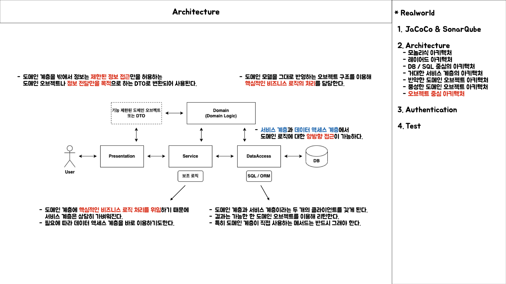

# 9. 스프링 프로젝트 시작하기

스프링을 이용해 애플리케이션 프로젝트를 처음 구성할 때 알아야 하는 기본적인 내용에 대해서 알아보는 장이다.

스프링 개발에 도움이 되는 개발 툴과 빌드 방법에 대해서 살펴 보고, 스프링을 애플리케이션에 적용할 수 있는 아키텍처의 종류와 특징에 대해서 알아본다.

이전의 개발 툴은 크게 변함 없기도 하고, 환경에 따라 제한적인 부분이 있어서 휙 읽어도 된다. 빌드 방법에 대한 부분은 Maven에 대해서 훑어볼 수 있는 기회가 될 수 있다. 아키텍처에 대한 내용은 꼭 읽어봐야
하는 내용이라 생각한다.

책을 읽는 사람의 경력이나 경험에 따라서 다를 수도 있지만 경험이 부족한 경우 많은 프로젝트를 보지 못했을 수도 있기 때문에 책에서 언급하는 부분은 꼭 정독하고 고민해볼 것을 추천한다.

## 9.1 자바 엔터프라이즈 플랫폼과 스프링 애플리케이션

자바 언어를 사용하는 모든 종류의 프로젝트라면 스프링으로 만들 수 있다.

자바 엔터프라이즈 애플리케이션은 서버에서 동작하며, 클라이언트를 상대로 서비스를 제공하도록 되어 있다. 즉, 클라이언트의 요청을 받아서 그에 대한 작업을 수행하고 그 결과를 돌려주는 것이 기본적인 동작 방식이다.
하지만 클라이언트의 요청 없이도 정해진 시간이나 특정 이벤트 발생에 따라 독자적으로 작업을 수행하기도 한다.

### 9.1.1 클라이언트와 백엔드 시스템

클라이언트와 백엔드 시스템 구성으로 가장 많이 사용되는 구조는 클라이언트가 웹 브라우저이고, 백엔드 시스템이 DB인 구성이다. 웹 클라이언트와 DB가 사용되지 않는 시스템은 거의 없으니, 이를 스프링이 사용되는
애플리케이션의 기본 구조라고 생각 할 수 있다.

이 때 스프링의 주요 기능은 웹 브라우저에서 DB의 데이터를 저장, 조회하는 데 집중된다. 하나의 스프링 애플리케이션이 동시에 여러 종류의 클라이언트를 상대로 서비스를 제공하기도 하고, 메시징 서버, 메일 서버 등등
사용하기도 한다.

한 번에 여러 종류의 백엔드 시스템을 이용하는 것도 가능하고, 여러 개의 DB를 동시에 이용하는 것도 가능하다.

### 9.1.2 애플리케이션 서버

스프링으로 만든 애플리케이션을 자바 서버환경에 배포하기 위해서는 JavaEE 서버가 필요하다. JavaEE 표준을 따르는 애플리케이션 서버는 크게 두 가지로 구분할 수 있다.

- 경량급 WAS / 서블릿 컨테이너

스프링은 기본적으로 톰캣(Tomcat)이나 제티(Jetty) 같은 가벼운 서블릿 컨테이너만 있어도 충분하다.

서블릿 컨테이너로도 엔터프라이즈 애플리케이션에 필요한 핵심기능을 모두 이용할 수 있다. 기존에 EJB와 WAS를 사용해야 가능했던 선언적인 트랜잭션이나 선언적 보안, DB 연결 풀링, 리모팅이나 웹 서비스는 물론이고
추가적인 라이브러리의 도움을 받으면 분산/글로벌 트랜잭션까지도 가능하다.

- WAS

고가의 WAS를 사용하면 그만큼 장점이 있다. 미션 크리티컬한 시스템에서 요구하는 고도의 안정성이나 고성능 시스템에서 필수적인 안정적인 리소스 관리, 레거시 시스템의 연동이나 기존 EJB로 개발된 모듈을 함께
사용하는 등의 필요가 있다면 상용 또는 오픈소스 WAS를 이용할 수 있다.

WAS는 상대적으로 관리 기능이나 모니터링 기능이 뛰어나서 여러 대의 서버를 동시에 운영할 때 유리한 점이 많다.

스프링의 개발팀은 필요할 떄는 비용을 들이더라도 적합한 조건을 가진 WAS를 사용할 것을 권장한다. 무조건 해야 한다는 아니고, WAS를 사용할 때 분명한 이유와 근거가 있는지 먼저 충분히 검토해야 한다.

훨씬 가볍고 빠르며 저렴한 비용으로 사용할 수 있는 서블릿 컨테이너로도 대개는 충분한데 특별한 이유도 없이 무겁고 다루기 힘든데다 비싸기까지한 WAS를 사용할 필요는 없기 때문이다.

> 스프링 소스 tcServer

일반적으로 개발환경과 운영환경에서 가장 많이 사용되는 자바 서버는 웹 모듈만 지원하는 서블릿 컨테이너인 아파치 톰캣이다.

스프링 개발에 책임지고 있는 기업인 스프링소스의 전문가들이 톰캣을 기반으로 엔터프라이즈 스프링 애플리케이션에 최적화된 경량급 애플리케이션 서버인 tcServer를 개발했다.

tcServer를 이용하면 기존 톰캣에서는 아쉬웠던 고급 서버 관리 기능, 배포 기능과 진단 기능을 포함해서 톰캣 전문가에게 받는 기술지원도 함께 제공받을 수 있다.

tcServer의 큰 장점은 스프링 개발회사가 개발하는 것인 만큼 스프링 애플리케이션 개발과 운영에 꼭 필요한 중요한 기능이 많이 제공된다는 점이다.

tcServer는 개발자 버전이 따로 있어서 개발을 위해서라면 자유롭게 이용 가능하다.

### 9.1.3 스프링 애플리케이션의 배포 단위

스프링으로 만든 애플리케이션은 세 가지 단위로 배포할 수 있다.

- 독립 웹 모듈

스프링은 보통 war로 패키징된 독립 웹 모듈로 배포된다. 톰캣 같은 서블릿 컨테이너를 쓴다면 독립 웹 모듈이 유일한 방법이다.

WAS로 배포한다고 하더라도 독립 웹 모듈을 사용하는 경우가 대부분이다. 여러 개의 웹 모듈을 묶어서 하나의 웹 어플리케이션 모듈로 만들지 않는 한 독립 웹 모듈이 가장 단순하고 편리한 배포 단위이다.

- 엔터프라이즈 애플리케이션

경우에 따라 확장자가 ear인 엔터프라이즈 애플리케이션으로 패키징해서 배포할 수 있다.

스프링 애플리케이션에서 EJB 모듈을 긴밀하게 사용하거나 반대로 EJB 모듈에서 스프링으로 만든 애플리케이션을 이용해야 한다면, EJB와 스프링 웹 모듈을 엔터프라이즈 애플리케이션으로 통합해야 한다. EJB 모듈은
없지만 엔터프라이즈 애플리케이션 배포 방식을 선택하는 경우가 있다. 하나 이상의 웹 모듈과 별도로 분리된 공유 가능한 스프링 컨텍스트를 엔터프라이즈 애플리케이션으로 묶어주는 방법이다.

- 백그라운드 서비스 모듈

rar 패키징 방법 또한 존재한다. rar는 리소스 커넥터를 만들어 배포할 때 사용하는 방식으로, 스프링으로 만든 애플리케이션이 UI를 가질 필요는 없고, 서버 내에서 백그라운드 서비스처럼 동작할 필요가 있다면
rar 모듈로 만들어서 배포할 수 있다. 이때는 J2EE 1.4나 그 이상의 표준을 따르는 WAS가 필요하다.

운영 플랫폼이나 서버의 종류는 개발 중에라도 언제든지 필요에 따라 변경이 가능하다.

어차피 서블릿 컨테이너나 웹 모듈 모두 JavaEE 표준의 일부일 뿐이기 때문에 설정만 바꾸면 어렵지 않게 이전이 가능하다.

다만 특정 서버환경에서만 제공하는 기능을 사용한다면 변경이 힘들 수도 있다. 장기적으로 서버를 변경하거나 서버의 종류를 바꿀 가능성이 있다면, 서버의 기능에 종속되지 않도록 주의하거나 손쉽게 다른 서버의 기능으로
변경 가능하도록 추상화해서 사용해야 한다.

## 9.2 개발도구와 환경

개발 시에 퍼포먼스를 향상 시킬 수 있는 방법 중 하나는 개발 도구이다. 개발 도구는 사용하는 언어의 자동완성이나 디버깅에 도움을 주어 보다 높은 분석력과 개발 속도를 높일 수 있다.

### 9.2.1 JavaSE와 JavaEE

> JavaSE / JDK

스프링 4, 5를 사용할 때 필요한 JDK 버전에 대해서 이야기 하는 내용으로 현재 스프링 5를 사용하기 위해서는 JDK 1.8버전을 사용해야 한다. 라고 정리 할 수 있을 것 같다.

> JavaEE / J2EE

J2EE를 잘모르는 듯.. 일단 책의 내용을 적어보면..

스프링 3.0이 사용될 자바 엔터프라이즈 플랫폼으로는 J2EE 1.4 버전이나 JavaEE 5.0이 필요하고 한다. 스프링 3.0 자체는 JDK6.0과 JavaEE 5.0을 기준으로 개발되었지만, 주요 기능은 JDK
5.0에서 동작하는 J2EE 1.4버전과 호환되게 제작되어 있다.

다만 J2EE 1.4 버전 서버를 사용할 때는 JDK 5.0에서 동작하는지 반드시 확인해야 한다. 만약 WAS 자체가 JDK 5.0에서는 사용할 수 없다면 스프링 3.0의 이용은 불가능하다.

그러니까 스프링 3.0의 최소 사양은 JDK 5.0이기 때문에 JDK 5.0이 호환되지 않는 WAS를 사용한다면 문제가 발생할 수 있다.

### 9.2.2 IDE

스프링 애플리케이션은 자바 5 또는 그 이상의 언어를 지원하는 자바 개발도구와 스키마를 지원하는 XML 편집기 정도만 있다면 어떤 개발환경에서는 불편 없이 개발이 가능하다.

ANT나 Maven 같은 빌드 툴을 지원하고 톰캣이나 자바 서버로 바로 배포해서 실행해 볼 수 있는 환경이라면 더 좋다.

옛날 notepad로 개발하는 시대가 아니기 때문에 모든 일을 처리할 수 있도록 만들어진 통합개발환경(IDE)을 사용하는 것이 좋다.

이클립스와 IntelliJ IDEA의 점유율이 높고 사용할 수 있는 환경에 따라서 도입해서 사용하면 될 것 같다.

둘다 장단점이 존재하며 IntelliJ는 무료 버전과 유료버전이 존재하는데 유료 버전을 사용하는 경우 많은 기능을 통합 툴로 한번에 사용할 수 있어서 좋다.

### 9.2.3 SpringSource Tool Suite

여기서는 이클립스를 사용하는 환경에서 STS를 사용해 볼 것을 추천하며 어떤 부분에서 이클립스보다 나은 기능을 제공하는지 소개한다.

STS는 이클립스를 기반으로 주요한 스프링 지원 플러그인과 관련 도구를 모아 스프링 개발에 최적화되도록 만들어진 IDE이다. 이클립스와 같이 플러그인 방식을 지원하는 툴을 사용하면 원하는 기능을 필요에 따라 추가할
수 있다는 장점이 있다. 반면 플러그인을 사용한다는 말은 플러그인과 이클립스의 버전이 호환되도록 계속 관리해야 한다는 것을 감안해야 한다.

이클립스의 문제점이 플러그인의 버전이 올라가서 업데이트 했을때 의존성에 대해서 고려하여 설치한다는 것을 문제점으로 들어 STS의 경우 플러그인의 의존성에 대해서 호환성 문제 또는 버전 이슈를 충분히 검증한다는 장점이
있다.

> SpringIDE 플러그인

SpringIDE는 스프링 개발에 유용한 기능을 제공하는 플러그인의 모음이다. 스프링 프로젝트와 설정파일 생성 위저드, 편리한 스프링의 XML 설정파일 에디터, 빈의 의존관계 그래프, 네임스페이스 관리 기능 등의
편리한 기능과 도구를 제공한다.

XML 설정파일을 사용하게 되면 빈의 클래스이름이나 레퍼런스 이름을 입력하면서 오타가 발생하기 쉽다. 빈의 클래스 이름은 패키지를 포함해서 전체 클래스 이름을 입력해야 하기 때문에 번거롭다. 하지만
SpringIDE가 제공하는 XML 설정파일 에디터를 이용하면 클래스 이름이나 참조하는 빈의 이름을 실시간으로 검증해서 오류를 확인해주기 때문에 오타로 인한 에러의 위험을 사전에 방지해준다.

클래스 이름이나 프로퍼티 이름을 자바 편집기 내의 자동완성 기능과 비슷하게 찾을 수 있게 해줘서 매우 편리하다. SpringIDE의 XML 에디터의 자동완성 기능 몇 가지를 정리한다.

- 빈 클래스 이름 자동완성

이클립스보다 유용한 기능은 bean 태그의 class 애트리뷰트를 입력 시 클래스 이름에 대한 자동완성을 지원한다.

클래스 이름이 긴 경우, 빈의 프로퍼티, ref 어트리뷰트로 다른 빈을 참조할 때도 자동완성 기능을 통해 손 쉽게 추가가 설정이 가능하다.

- 빈 설정 오류검증 기능

자동완성 기능은 처음 입력할 때 유용하고, 개발 중에 클래스나 프로퍼티 이름이 변경됐거나 XML 파일을 직접 수정하는 경우에도 오류 검증 기능이 도움이 된다.

- 프로젝트 생성, 설정파일 생성, 빈 등록 위저드

스프링 프로젝트 생성을 위해 스프링 프로젝트 위저드를 이용할 수 있다. 하지만 스프링 프로젝트를 만드는데 필요한 라이브러리 선정이나 빌드 스크립트 추가, 프로젝트 구조 등을 지정할 수 있는 고급 기능등이 있다. 또한
미리 준비된 프로젝트 템플릿을 이용해 프로젝트를 생성하는 기능도 제공된다.

- 빈 의존관계 그래프

SpringIDE는 XML 설정 파일을 읽어서 자동으로 그래프를 그려주는 기능을 제공한다. 각각의 빈이 어떻게 서로 참조하고 있는지, 어떤 프로퍼티를 갖고 있는지 한 눈에 볼 수 있다.

- AOP 적용 대상 표시

AOP가 어려운 이유는 부가기능을 담은 어드바이스가 어느 오브젝트에 적용될 지 한 눈에 보이지 않기 때문이다. @Transactional처럼 직접 AOP 적용 클래스나 인터페이스에 어노테이션을 추가하는 특별한 방법을
사용하는 경우는 그나마 낫다. 하지만 포인트 컷 표현식을 사용하거나 이름 패턴을 이용하는 포인트컷 빈을 이용하는 경우에는 적용 대상을 파악하기가 쉽지 않다.

그래서 가능한 단순한 포인트컷 표현식을 사용하고 명확한 규칙을 가지고 적용 대상 빈을 선정해야 한다.

STS에는 SpringIDE 외에도 AJDT라는 AspectJ 개발 플러그인이 함께 설치되어 포인트컷이 적용되는 대상 빈을 설정파일 안에서 한눈에 확인 할 수 있다.

빈의 이름을 사용해 트랜잭션 적용 대상을 선정하는 방식은 메서드 시그니처를 이용한 포인트컷 표현식 보다 만들기 쉽고 대상을 확인하기가 명확해서 자주 사용된다.

AOP 적용 마커는 포인트컷을 XML에서 정의하지 않고 @Transactional 어노테이션을 사용한 경우에도 동일하게 나타나 개발 및 분석에 도움을 준다. STS에서 AOP마커를 보이게 하기 위해서는 프로젝트를
스프링 프로젝트로 만들고, 프로젝트 설정의 Spring-Bean Support 항목에 XML을 추가해줘야 한다.

> STS 플러그인

STS 플러그인은 스프링 개발과 설정파일 편집을 지원하는 SpringIDE에 더해서 스프링 애플리케이션의 서버 배치와 같은 추가 기능을 제공해준다. 또 VMWare 가상화 클라우드 서비스에도 손쉽게 스프링
애플리케이션 배치할 수 있도록 지원한다. 스프링 개발 시 자주 발생하는 예외에 대한 지식 베이스를 검색해볼 수 있는 기능도 제공한다.

> 기타 플러그인

STS가 추가로 제공하는 플러그인 중 유용한 플러그인을 소개한다.

- M2Eclipse

Maven을 지원하는 이클립스 플러그인으로 STS도 동일하게 지원하여 Maven 관리를 더욱 효율적으로 할 수 있도록 한다.

- AJDT

AspectJ Development Tool의 약자로, 이클립스에서 AspectJ AOP를 이용한 개발을 지원하는 편리한 툴이다. 스프링 애플리케이션에서 AspectJ 방식의 AOP를 사용하는 경우 AspectJ와
관련된 편집 기능과 AOP 적용 대상에 대한 마커 등의 AJDT기능을 활용할 수 있다.

- VMCI

VMCI(Virtual Machine Core Integration) 플러그인은 VMWare 서버 또는 워크스테이션과의 연동을 지원하는 플러그인이다. STS의 VMWare 배치 기능에 주로 사용되기 위해 추가된
것으로 가상화 서버나 클라우드 서비스에 관한 기능이 추가되는 경우 유용할 것으로 예상한다고 한다.

- 이클립스 표준 플러그인

이클립스 플랫폼에서 제공하는 주요 표준 플러그인에 포함된 것으로는 웹 개발을 지원하는 WTP(Web Tool Platform), EMP(Eclipse Modeling Project), Mylyn, DSDP(
Device Software Development Platform)등이 있다.

### 9.2.4 라이브러리 관리와 빌드 툴

애플리케이션의 아키텍처를 결정하고 사용 기술을 선정하고 나면 애플리케이션 프로젝트를 IDE에 구성하게 되는데, 이때 가장 어려운 부분은 바로 필요한 프레임워크 모듈과 라이브러리 파일을 선택해서 프로젝트의 빌드 패스를
넣어주는 일이다.

> 라이브러리 관리의 어려움

하나의 프로젝트를 만들기 위해서 사용하는 라이브러리는 적게는 한자리 수에서 많게는 세 자리 수까지 포함해야 할 때가 있다. 그리고 라이브러리마다 여러 개의 버전이 있어 각 라이브러리마다 정확히 어떤 버전을 사용해야
하는지 알아야 한다.

또한 필요한 라이브러리 조합을 만들다보면 복잡한 의존관계 속에서 같은 라이브러리의 다른 버전이 동시에 필요한 경우가 생겨 문제가 발생하는 경우도 있다.

자바는 모듈이라는 개념이 없는데, jar는 기본적으로 압축 패키징 방법일 뿐이지 구분 가능한 독립된 모듈이 아니다. 만약 같은 패키지와 이름을 가진 클래스지만 구현이 다른 클래스 파일 a.jar, b.jar가
존재하며 모두 클래스 패스에 있다고 가정할 때, 이 경우 모듈 a.jar 안에 있는 클래스를 사용하겠다거나 b.jar 안에 있는 클래스를 사용하겠다고 선택할 수 있을까?

a.jar, b.jar가 같은 웹 모듈의 라이브러리에 등록되어 있다면 jar 파일 구분은 별 의미가 없다.

다시 정리하면 이러한 문제를 해결하기 위해서 재패키징 방법을 사용하여 한쪽 버전의 클래스를 다른 패키지로 옮겨 서로 구별되는 클래스로 만들게 된다.

재패키징 방법은 모든 소스 또는 바이트코드를 일일이 찾아서 수정해주는 작업으로 쉽지 않다.

> 라이브러리 선정

다행히 위 문제가 없는 상태에서 프로젝트의 기본 틀이 잡혀 있고, 사용할 라이브러리와 프로젝트 폴더 구조까지 다 결정된 프로젝트에 참여해서 순수한 애플리케이션 개발에 전념할 수 있다면 걱정하지 않아도 된다. 하지만
자신이 직접 프로젝트를 구성하고 필요한 라이브러리를 선정하거나 추가, 제거 하는 등의 관리를 해야 하는 상황이라면 여러모로 신경써야 할 것들이 많다.

가장 먼저 해야 할 작업은 스프링으로 만드는 애플리케이션에서 정확히 어떤 기능이 필요한 지 정리하는 것이다. 각 기능을 지원하는 기술이 여러 종류가 있다면 그 중에 어떤 것을 사용할지도 결정해야 한다.

- 스프링 모듈

사용할 기능과 기술 목록이 정의되었다면 스프링 모듈부터 선정한다. 스프링 모듈의 일부는 모든 애플리케이션에서 공통적으로 사용되는 필수 모듈이고 그 외에는 애플리케이션의 아키텍처와 사용 기술에 따라서 선택적으로 적용할
수 있다.

스프링 모듈 사이에도 의존관계가 존재하며 의존 관계에는 필수와 선택으로 나뉘어진다.

- 라이브러리

스프링의 각 모듈은 또 다른 모듈에 의존하기도 하지만 오픈소스 라이브러리 또는 표준 API를 필요로 하기도 하고 경우에 따라서는 상용 제품의 라이브러리에 의존한다.

때로는 각 라이브러리를 활용하는 방법에 따라서 다른 서드파티 라이브러리를 필요로 하는 경우가 있다. 이 때는 해당 프레임워크나 라이브러리의 문서를 참조하여 필요한 라이브러리가 어떤 것인지 직접 찾아봐야 한다.

라이브러리 관리는 어떤 방법을 쓰더라도 간단하지 않다. 이미 만들어진 다양한 프레임워크와 라이브러리의 조합으로 애플리케이션을 만드는 시대이기 때문이다.

> 빌드 툴과 라이브러리 관리

Maven과 Ant는 자바의 대표적인 빌드 툴이다. (gradle도 있다.) 빌드 툴은 개발팀이나 조직의 정책 또는 경험에 따라서 결정하면 될 것이고, 여기서는 빌드 툴이 지원하는 의존 라이브러리 관리 기능에 대해서
알아본다.

IDE는 코드만 작성하면 자동으로 컴파일 해주는 자동빌드 기능이 있고, 관련 빌더를 추가하거나 확장함으로써 복잡한 빌드 작업도 간단하게 진행할 수 있다.

하지만 IDE를 사용할 수 있는 환경이 아닌 경우에도 일관된 빌드가 가능하도록 만드는 것이 중요하다.

예를 들어 서버에 배치했을 때나 통합 테스트 환경에서 애플리케이션을 직접 빌드해야 하는 경우가 있다. 이러한 경우에 IDE에서와 동일하게 애플리케이션 빌드 작업이 수행되어야 하는데 이러한 경우를 대비해서 IDE를
사용하되 ant, maven, gradle 같은 환경에서 독립적인 빌드 툴을 함께 사용하는 것이 바람직하다.

ant가 이클립스에 기본 내장되어 제공될 정도로 표준 자바 빌드 툴로 자리잡을 때 maven이라는 새로운 개념의 빌드 툴이 등장 했다. Maven은 단순 빌드 툴을 넘어서 개발 과정에서 필요한 빌드, 테스트, 배치,
문서화, 리포팅 등의 다양한 작업을 지원하는 종합 프로젝트 관리 툴의 성격을 띠고 있다.

Maven의 특징은 POM이라고 불리는 프로젝트 모델 정보를 이용한다는 것이다.

절차적인 스크립트와 구조가 비슷한 ant와는 달리 maven은 선언적이다. 프로젝트의 주요한 구조와 특징, 필요한 정보를 POM의 프로젝트 모델 정보로 만들어두면, 이를 참조해서 Maven에 미리 정해진 절차에 따라
빌드 또는 프로젝트 관리 작업을 진행할 수 있다.

Maven POM이 가진 독특한 특징 중의 하나는 애플리케이션이 필요로 하는 의존 라이브러리를 선언해두기만 하면 원격 서버에서 이를 자동으로 다운로드 받아서 사용할 수 있게 해주는 것이다. 예를 들어 애플리케이션의
의존정보를 Pom.xml에 작성해두면 Maven으로 빌드 할 때 필요한 라이브러리가 개발 PC의 공통 저장소에 있는 지 확인하고 없으면 Maven의 원격 서버에서 자동으로 다운로드 받아서 설치해준다.

Maven의 의존 라이브러리 관리 기능이 제공하는 유용한 기능은 전이적 의존 라이브러리 추적 기능이다. POM의 의존정보에 하나의 라이브러리를 지정하면, 지정된 라이브러리가 동작하는데 여타 라이브러리까지 함께
다운로드 해주는 기능이다.

프로젝트에 의존 라이브러리 정보만 갖게 하고 필요한 라이브러리는 Maven 빌드 과정 중에 자동으로 다운로드 받거나 로컬 공통 리포지토리에서 가져오게 하여 효율적으로 관리하게끔 돕는다.

프로젝트마다 사용 기술과 아키텍처를 모두 뒤집어서 다르게 구성하는 경우는 드문데, 이때 활용할 수 있는 것이 공통 의존 라이브러리 정보로 만들어 의존정보를 정의하여 의존성 관리를 하는 것도 가능하다.

> 스프링 모듈의 두 가지 이름과 리포지토리

스프링 모듈 jar 파일의 이름을 보면 두 가지 종류가 있다. `spring-`으로 시작하는 모듈과 `org.`로 시작하는 모듈 두 가지 이름의 파일이 존재한다.

`spring-`으로 시작하는 파일 명은 Maven에서 사용하는 명명 규칙을 따른것으로 아티펙트 아이디와 버전을 조합해서 파일이름으로 사용한다. 만약 일반 Maven 리포지토리에서 스프링 모듈을 검색하면 이와 같은
이름의 파일을 발견할 수 있다.

`org.`로 시작하는 파일 명은 OSGi의 모듈 명명 규칙을 따른것으로 OSGi 플랫폼에서 사용하지 않는다고 할지라도 OSGi 스타일의 모듈 이름을 사용하도록 권장한다. 그래서 스프링 배포 버전의 dist 폴더에
들어있는 모듈 이름도 모두 OSGi 스타일의 이름이다.

OSGi 호환 이름을 갖는 스프링 모듈을 사용하는 경우 Maven 표준 리포지토리 대신 스프링 소스가 제공하는 엔터프라이즈 번들 리포지토리를 사용해야 한다.

```xml
<!-- 스프링 소스 OSGi 번들 리포지토리를 이용하는 경우 -->
<dependency>
    <groupId>org.springframework</groupId>
    <artifactId>org.springframework.core</artifactId>
</dependency>
```

## 9.3 애플리케이션 아키텍처

클라이언트와 백엔드 시스템의 종류와 사용 기술, 연동 방법을 결정했다면 시스템 레벨의아키텍처는 대략 구성된 셈이다. 다음으로 결정할 사항은 스프링 웹 애플리케이션의 아키텍처이다.

아키텍처는 여러가지 방식으로 정의되고 이해될 수 있는 용어로 가장 단순한 정의를 보면 어떤 경계 안에 있는 내부 구성요소들이 어떤 책임을 갖고 있고, 어떤 방식으로 서로 관계를 맺고 동작하는지 규정하는 것이라 할 수
있다.

아키텍처는 단순하게 정적인 구조를 나타내는 것으로만 생각하기 쉽지만 실제로는 그 구조에서 일어나는 동적인 행위와 깊은 관계가 있다.


### 9.3.1 계층형 아키텍처

관심, 책임, 성격, 변하는 이유와 방식이 서로 다른 것들을 분리함으로써 분리된 각 요소의 응집도는 높여주고, 서로의 결합도를 낮춰줬을 때의 장점과 유익이 무엇인지 살펴봤다.

성격이 다른 모듈이 강하게 결합되어 한데 모여 있으면 한 가지 이유로 변경이 일어날 때 그와 상관이 없는 요소도 함께 영향을 받게 된다. 따라서 불필요한 부분까지 변경이 일어나고 그로 인해 작업은 더뎌지고 오류가
발생할 가능성이 높아진다.

어느 부분을 수정해야 할지를 파악하기도 쉽지 않기 때문에 인터페이스와 같은 유연한 경계를 만들어두고 분리하거나 모아주는 작업이 필요하다.

> 아키텍처와 SoC

이전까지는 오브젝트 레벨에서 분리의 문제에 대해서 생각해 봤다. 성격이 다른 코드가 얽혀있는 것을 두 개의 오브젝트로 분리하고, 그 사이에 유연한 결합을 가질 수 있도록 인터페이스를 두고, 그 관계를 맺어주는 제
3의 존재인 DI 컨테이너를 둬서 오브젝트끼리는 직접적인 관계를 알지 못하도록 만드는 것이 지금까지 해온 DI를 기반으로한 유연한 설계와 구현 전략이었다.

이러한 원리는 아키텍처 레벨에서도 동일하게 적용할 수 있다. 오브젝트를 하나의 모듈 단위라고 생각해보면 때론 그보다 작은 단위, 예를 들면 하나의 클래스 안에 있는 메서드 레벨에서도 같은 원리를 적용할 수 있다.
심지어 하나의 메서드 안의 코드에도 같은 방식의 접근이 가능하다. 반대로 모듈의 단위를 크게 확장해 볼 수도 있다.

애플리케이션을 구성하는 오브젝트들을 비슷한 성격과 책임을 가진 것들끼리 묶을 수도 있다. 또 비즈니스 로직을 구현해놓은 비즈니스 서비스 오브젝트들도 같은 성격으로 묶을 수 있다. 서비스 오브젝트들은 특정 기술과
환경에 종속되지 않으면서 도메인의 업무에는 밀접하게 관련을 갖고 있는 POJO로 만들어진다.

서블릿 컨테이너로부터 받은 사용자의 요청정보를 해석해서 그것을 POJO 기반의 서비스 오브젝트에 전달해주고, 결과를 받아서 다시 웹 사용자 인터페이스에 표시 가능한 형태로 변환해주는 일을 한다.

성격과 책임이 분명히 다른 것들이 한데 모여있으면 많은 문제가 발생한다. 그래서 성격이 다른 것은 아키텍처 레벨에서 분리해주는 것이 좋다. 분리된 각 오브젝트는 독자적으로 개발과 테스트가 가능해서 개발과 변경 작업이
모두 빨라질 수 있다.

이렇게 책임과 성격이 다른 것을 크게 그룹으로 만들어 분리해두는 것을 아키텍처 차원에서 계층형 아키텍처(layered architecture)라 부른다. 또는 계층이라는 의미를 가진 티어(tier)를 사용하여 멀티
티어 아키텍처라고도 한다.

보통 웹 기반의 엔터프라이즈 애플리케이션은 일반적으로 세 개의 계층을 갖는다고 해서 3계층(3-tier 또는 3-layer) 애플리케이션이라고 한다.

<aside>
💡 tier라는 개념을 물리적 서버로 분리되어 각각의 목적에 따라 동작하는 것(N-Tier Architecture)으로 알고 있었는데 더 알아봐야 할듯

</aside>

물론 모든 엔터프라이즈 애플리케이션을 3계층으로 만들어야만 하는 것은 아니다. 경우에 따라서 전통적인 3계층 방식이 아닌 다른 구분 방법을 선택하기도 한다.

경우에 따라서 전통적인 3계층 방식이 아닌 다른 구분 방법을 선택하기도 한다. 또 각 계층을 좀 더 세분화해서 더 작은 단위의 계층으로 나눌 수 있다.

> 3계층 아키텍처와 수직 계층

3계층 아키텍처는 백엔드의 DB나 레거시 시스템과 연동하는 인터페이스 역할을 하는데 `데이터 액세스계층`, 비즈니스 로직을 담고 있는 `서비스 계층`, 주로 웹 기반의 UI를 만들어내고 그 흐름을
관리하는 `프레젠테이션 계층`으로 구분한다.

- 프레젠테이션 계층: 웹 계층 , UI 계층, MVC 계층
- 서비스 계층: 매니저 계층, 비즈니스 로직 계층
- 데이터 액세스 계층: DAO 계층, EIS 계층


- 데이터 액세스 계층

데이터 액세스 계층은 DB 외에도 ERP, 레거시 시스템, 메인프레임 등에 접근하는 역할을 하기 때문에 EIS(Enterprise Information System) 계층이라고도 한다. 하지만 대개는 장기적인 데이터
저장을 목적으로 하는 DB 이용이 주된 책임이다. 또 외부 시스템을 호출해서 서비스를 이용하는 것은 기반(infrastructure) 계층으로 따로 분류하기도 한다.

데이터 액세스 계층은 사용 기술에 따라서 다시 세분화된 계층으로 구분될 수 있다. 애플리케이션에서 담당하는 역할에 따라 분류한 3계층 구조와 달리, 데이터 액세스 계층 안에서 다시 세분화하는 경우에는 추상화 수준에
따른 구분이기 때문에 `수직적인 계층`이라고 부르기도 한다.

기본 3계층은 `기술 계층`보다는 역할에 따라 구분한 것으로 보통 그림으로 나타낼 때도 가로로 배열한다. 반면에 같은 책임을 가졌지만 `추상화 레벨`에 따라 구분하는 경우 세로로 배열해서 표현한다.

만약 추상 계층을 새로 추가하는 것은 부담스럽고 경우에 따라 유연하게 하위 계층의 API를 활용할 필요가 있다면, 공통적인 기능을 분리해서 유틸리티나 헬퍼 메서드 또는 오브젝트로 제공해주는 것도 좋은 방법이다.

- 서비스 계층

잘 만들어진 스프링 애플리케이션의 서비스 계층 클래는 이상적인 POJO로 작성된다. POJO로 잘 만든다면 객체지향적인 설계 기법이 적용된 코드를 통해서 비즈니스 로직의 핵심을 잘 담아내고, 이를 쉽게 테스트하고
유연하게 확장할 수 있다.

서비스 계층은 DAO 계층을 호출하고 이를 활용해서 만들어지는데 때로는 서버나 시스템 레벨에서 제공하는 기반 서비스를 활용할 필요도 있다. 예를 들면 웹 서비스와 같은 원격 호출을 통해 정보를 가져오거나 메일 또는
메시징 서비스를 이용하는 것이 대표적인 예이다 .

기반 서비스는 3계층 어디서나 접근이 가능하도록 만들 수도 있고, 아키텍처를 설계하기에 따라서 반드시 서비스 계층을 통해 사용되도록 제한할 수도 있다.

서비스 계층은 특별한 경우가 아니라면 추상화 수직 계층구조를 가질 필요가 없다. 단순하게 POJO 레벨에서 비즈니스 로직을 모델링하다가 상속 구조를 만들 수 있을 진 몰라도 기술 API를 직접 다루는 코드가 아니기
때문에 기술에 일관된 방식으로 접근하게 하거나 편하게 사용하게 해주는 추상화는 필요 없기 때문이다.

일반적으로 서비스 계층이 필요에 따라 기반 서비스 계층의 API를 호출해서 이용한다. 하지만 반대로 서비스 계층의 코드를 기반 서비스 계층에서 실행시키는 경우가 있다. 스케줄링이 대표적인 경우이다. 미래 정해진
시간에 특정 서비스 계층의 로직이 동작하게 만드는 백그라운드 서비스가 필요하다면 그때는 기반 서비스 계층에서 서비스 계층의 오브젝트를 이용하게 할 수도 있다.

원칙적으로는 서비스 계층 코드가 기반 서비스 계층의 구현에 종속되면 안된다. 서비스 계층의 코드는 추상화된 기반 서비스 인터페이스를 통해서만 접근하도록 만들어 특정 구현과 기술에 대한 종속성을 제거해야 한다. 또는
AOP를 통해서 서비스 계층의 코드를 침범하지 않고 부가기능을 추가하는 방법을 활용해야 한다.

이상적인 서비스 계층은 백엔드 시스템과 연결되는 데이터 액세스 계층이 바뀌고, 클라이언트와 연결되는 프레젠테이션 계층이 모두 바뀌어도 그대로 유지될 수 있어야 한다.

엔터프라이즈 애플리케이션에서 가장 중요한 자산은 도메인의 핵심 비즈니스 로직이 들어있는 서비스 계층이어야 한다.

- 프레젠테이션 계층

프레젠테이션 계층은 매우 다양한 기술과 프레임워크의 조합을 가질 수 있다. 엔터프라이즈 애플리케이션의 프레젠테이션 계층은 클라이언트의 종류와 상관없이 HTTP 프로토콜을 사용하는 서블릿이 바탕이 된다. 물론 HTTP
외의 프로토콜을 사용하는 엔터프라이즈 서비스가 전혀 없는 것은 아니다.

프레젠테이션 계층은 다른 계층과 달리 클라이언트까지 그 범위를 확장될 수도 있다. 화면의 흐름을 결정하는 것이나 사용자 입력 값에 대한 검증, 서비스 계층의 호출과 전달되는 값의 포맷의 변화, 뷰라고 불리는 화면을
어떻게 그릴지에 대한 로직 등이 모두 서버에서 처리된다.

> 계층형 아키텍처 설계의 원칙

오브젝트와 그 관계에 적용했던 대부분의 객체지향 설계의 원칙은 아키텍처 레벨의 계층과 그 관계에도 동일하게 적용할 수 있다. 각 계층은 응집도가 높으면서 다른 계층과 낮은 결합도를 유지할 수 있어야 한다.

각 계층은 자신의 계층의 책임에만 충실해야 한다. 데이터 액세스 계층은 비즈니스 로직을 담거나 웹 파라미터를 파싱하는 코드나 결과를 화면에 어떻게 뿌릴지 결정하는 코드가 들어간다면 응집도가 낮아진다.

결과적으로 변화에 대한 유연성이 떨어지고 이해하기 힘든 코드를 가진 계층이 되고 말 것이다. 각 계층은 자신의 역할에만 충실해야 하고 자신과 관련된 기술이 아닌 다른 기술 API의 사용을 삼가해야 한다.

각 계층이 자신의 책임에 충실하게 작성되어 있다면 필요한 그 밖의 작업은 다른 계층에 요청하게 될 것이다. 이때 계층 레벨에 정의한 인터페이스를 통해서 요청하게 되고, 계층 간에 사용되는 인터페이스 메서드에는 특정
계층의 기술이 최대한 드러나지 않게 만들어야 한다. 그렇지 않으면 계층 사이에 결합도가 높아질 뿐만 아니라, 계층 간에 기술이나 역할이 서로 침범하는 일이 일어난다.

계층 간에 강한 결합이 생기면 유연성이 떨어지기 때문에 각 계층의 내부 구현이 변화되면 다른 계층의 코드도 함께 수정해줘야 한다. 또한 코드의 중복이 일어날 가능성이 높고 전체 코드를 이해하기는 힘들어진다. 오브젝트
간의 강한 결합이 있을 때 발생하는 문제와 성격이 유사하고 그 파장은 훨신 심각하다.

서비스 계층의 메서드에 JDBC 기술 종속적인 체크 예외를 던지는 경우, 프레젠테이션 계층의 오브젝트(HttpServletRequest, HttpServletResponse)를 그대로 서비스 계층으로 전달하면
안된다.

계층의 결계를 넘어갈 때는 반드시 특정 계층에 종속되지 않는 오브젝트 형태로 변환해줘야 한다. 특정 기술에 종속적인 내용이 계층을 넘어서 전달되는 순간 코드의 재사용이 불가능해지고, POJO기반 단위 테스트 또한
작성하기 힘들어진다.

어떠한 경우에라도 계층 사이의 낮은 결합도를 깨뜨리지 않도록 설계 해야 한다. 당연히 계층 사이의 호출은 인터페이스를 통해 이루어져야 한다. 인터페이스를 사용하게 한다는 것은 각 계층의 경계를 넘어서 들어오는 요청을
명확하게 정의하겠다는 의미이다.

인터페이스는 다른 계층에서 꼭 필요한 메서드만 정의하여야 한다.

스프링의 DI는 기본적으로 오브젝트 사이의 관계를 다루는데 계층 사이의 경계나 그 관계에 직접적으로 관여하지 않는다. 하지만 모든 경계에는 오브젝트가 존재하고 그 사이의 관계도 오브젝트 대 오브젝트로 정의되기
마련이다.

그런 면에서 `스프링의 DI가 계층 사이의 관계에도 적용`된다고 볼 수 있다. 하지만 DI는 계층을 구분해주지는 않기 때문에 `빈 사이의 의존관계를 만들 때 주의`해야 한다. 한 계층의 내부에서만
사용되도록 만든 빈 오브젝트가 있는데, 이를 DI를 통해 함부로 가져다 쓰는 일은 피해야 한다는 말이다. 또 중간 계층을 건너뛰어 관계를 갖지 않는 계층의 빈을 직접 DI 하지 않도록 주의해야 한다.

### 9.3.2 애플리케이션 정보 아키텍처

엔터프라이즈 시스템은 본질적으로 동시에 많은 작업이 빠르게 수행되어야 하는 시스템이다. 일반적으로 사용자의 요청을 처리하는 동안만 간단한 상태를 유지라기 때문에 애플리케이션의 주요 상태정보는 클라이언트나 백엔드
시스템에 분산되어 보관된다.

하나의 업무 작업이 여러 번의 요청과 페이지에 걸쳐 일어나는 경우에 유지되어야 하는 임시 상태정보는 클라이언트에 일시적으로 보관되기도 하고, 서버의 사용자별 세션 메모리에 저장되기도 한다.

애플리케이션을 사이에 두고 흘러다니는 정보를 어떤 식으로 다룰 지를 결정하는 일도 아키텍처를 결정할 때 매우 중요한 기준이 된다. 엔터프라이즈 애플리케이션에 존재하는 정보를 단순히 데이터로 다루는 경우와 오브젝트로
다루는 경우, 두 가지 기준으로 구분해볼 수 있다.

데이터 중심 아키텍처는 애플리케이션에 흘러다니는 정보를 단순히 값이나 값을 담기 위한 목적의 오브젝트 형태로 취급하는 구조다. 데이터 중심 설계의 특징은 비즈니스 로직이 DB 내부의 저장 프로시저나 SQL에 담겨
있는 경우가 많다는 점이다. 보통 DB에서 돌려주는 내용을 그대로 Map이나 단순 결과 저장용 오브젝트에 넣어서 전달한다.

데이터 중심 아키텍처는 핵심 비즈니스 로직을 어디에 많이 두는지에 따라서 `DB에 무게를 두는 구조`와 `서비스 계층의 코드에 무게를 두는 구조`로 구분할 수 있다.

> DB/SQL 중심의 로직 구현 방식

데이터 중심 구조의 특징은 하나의 업무 트랜잭션에 모든 계층의 코드가 종속되는 경향이 있다는 점이다. 요구사항에 따라 만들어진 SQL의 결과는 컬럼 이름을 키로 갖는 Map에 저장되거나 조회 페이지에 필요한 정보를
담을 수 있는 단순한 오브젝트를 저장되어 전달된다.

SQL의 내용이 바뀌면 모든 계층의 코드가 함께 변경되어 종속적일 뿐 아니라 배타적이어서 다른 단위 업무에 재사용되기 힘들다.

대용량 데이터를 다루면서 빠른 처리가 필요한 경우 일부 로직을 DB 내에 존재하는 PL/SQL 과 같은 저장 프로시저 형태로 만들기도 한다.


이런 식의 아키텍처는 자바 기술이 발전하기 전의 엔터프라이즈 시스템에서 흔하게 발견할 수 있다. 굳이 자바라는 객체지향 언어와 프로그래밍 기술을 사용하지 않더라도 3계층 구조로 만드는 전통적인 개발 방법에서, 또는
서비스 계층이 별 의미가 없으므로 주요 로직을 클라이언트의 독립 프로그램에 담아두고 DB 처리 로직만 DB에 분리해둔 2계층 구조에서도 비슷하게 발견할 수 있다.

개발은 쉬우나 자바 코드를 단지 DB와 화면을 연결해주는 단순한 인터페이스 도구로 전락시키는 것이며, 자바를 쓰지 않아도 별 차이가 없다.

이러한 개발 방식은 변화에 매우 취약하다. 객체지향의 장점이 활용되지 못한데다 각 계층의 코드가 긴밀하게 연결되어 있기 때문이다. 중복을 제거하기도 쉽지 않다.

로직을 DB와 SQL에 많이 담으면 담을수록 점점 확장성이 떨어진다. DB에는 확장에 한계가 있을 뿐 아니라 확장한다 하더라도 매우 큰 비용이 든다.

상대적으로 애플리케이션 서버와 그 안에 담긴 오브젝트는 비용이 적게 든다. 서버를 늘려 쉽게 확장할 수도 있고, 손쉽게 여러 대의 서버를 클러스터로 묶어서 하나의 서버처럼 동작하게 만들 수 있다. 오브젝트를 만들고
코드를 동작시키는 비용은 DB에서 비슷한 작업을 할 때에 비해 저렴하다. 따라서 로직을 DB보다는 애플리케이션으로 가져오는 편이 유리하다. 비용도 저렴해질 뿐 아니라 안정성도 높아지고 코드를 검증하기도 매우 편하다.

SQL이나 저장 프로시저에 담긴 로직은 테스트 하기 힘드나 오브젝트에 담긴 로직은 간단히 검증이 가능하다. DB에는 부하를 가능한 주지 않는 간단한 작업만 하고 복잡한 로직은 오브젝트에 담아서 애플리케이션 내에서
처리하도록 만드는 편이 낫다.

결국 정책적인 부부이나 현실적인 부분으로 인하여 아키텍처와 접근 방법을 어쩔 수 없이 선택해야 할 수도 있지만, 단순히 익숙하고 편하다는 이유로 스프링 애플리케이션 개발에도 여전히 DB 중심의 아키텍처를 선택한다면
스프링의 장점을 제대로 누릴 수 있는 기회를 얻지 못할 것이다.

> 거대한 서비스 계층 방식

DB에서 가져온 데이터가 애플리케이션에 흘러다니는 정보의 중심이 되는 아키텍처이긴 하지만 DB에 많은 로직을 두는 개발 방법의 단점을 피하면서 애플리케이션 코드의 비중을 높이는 방법이 있다.

DB에는 부하가 걸리지 않도록 저장 프로시저의 사용을 자제하고 복잡한 SQL을 피하면서, 주요 로직은 서비스 계층의 코드에서 처리하도록 만드는 것이다.

많은 비즈니스 로직을 DB의 저장 프로시저나 SQL에서 서비스 계층의 오브젝트로 옮겨왔기 때문에 어플리케이션 코드의 비중이 커진다. 그만큼 구조는 단순해지고 객체지향 개발의 장점을 살릴 기회가 많아진다.

DAO와 SQL은 상대적으로 단순해지고, 그 중 일부는 여러 서비스 계층 코드에서 재사용이 가능해진다.

상대적으로 단순한 DAO 로직을 사용하고, 비즈니스 로직의 대부분을 서비스 계층에 집중하는 접근 방법은 결국 거대한 서비스 계층(fat service layer)을 만들게 된다. 데이터 처리 및 분석 그리고 비즈니스
로직의 대부분이 서비스 계층 코드에 집중되기 때문이다.

서비스 계층의 코드는 여전히 업무 트랜잭션 단위로 집중되어 만들어지기 때문에 DAO를 공유할 수 있는 것을 제외하면 코드의 중복도 적지 않게 발생한다.


거대 서비스 계층 방식의 아키텍처는 데이터 액세스 계층이나 DB는 비즈니스 로직을 직접 담고 있지 않기 때문에 이전보다 훨씬 가벼워진다. 대신 DB가 돌려주는 데이터를 가지고 비즈니스 로직을 구현하는 서비스 계층이
매우 두터워진다.

거대 서비스 계층 방식의 장점은 애플리케이션의 코드에 비즈니스 로직이 담겨 있기 때문에 자바 언어의 장점을 활용해 로직을 구현할 수 있고, 테스트 하기도 수월하다. DAO가 다루는 SQL이 복잡하지 않고,
프레젠테이션 계층과 뷰가 1:1로 매핑되지 않아도 되기 때문에 일부 DAO 코드는 여러 비즈니스 로직에서 공유해서 사용할 수 있다 .

데이터 액세스 계층의 SQL은 서비스 계층의 비즈니스 로직의 필요에 따라 만들어지기 쉬우며 그에 따른 계층 간의 결합도도 여전히 크다. 서비스 계층의 메서드는 크기가 큰 업무 트랜잭션 단위로 만들어지기 때문에 비슷한
기능의 코드가 여러 메서드에서 중복되어 나타나기 쉽다.

자주 사용되는 세부 로직을 추출해서 공통기능으로 뽑아내는 일도 불가능하진 않지만 일반화하기는 쉽지 않다. DAO가 제공해주는 값의 포맷에 따라 이를 취급하는 방법이 달라지기 때문이다.

DAO에 복잡한 조건의 로직을 넣지는 않더라도 서비스 계층에서 필요한 정보를 `한 번에 SQL을 통해 가져오고`, 그 값을 저장하는 방식이 일관성이 없이 매번 달라질 수 있기 때문에 서비스 계층의 코드나
DAO에 적지 않은 중복이 발생하는 것이다.

반면 장점은 각 단위 업무별로 독립적인 개발이 가능하므로 초기 개발속도가 빠르고, 개발자 사이에 간섭 없이 독립적인 개발이 가능하다는 장점이 있다. 또한 핵심 로직이 자바 코드 안에 있으므로 테스트 하기가 상대적으로
수월하다. 하지만 이는 본격적으로 객체지향적 설계를 적용하기도 힘들고, 개발자 개개인의 코딩 습관이나 실력에 따라 비슷한 로직이더라도 전혀 다른 스타일의 코드가 나오기 쉽다.

또한 계층별로 독립된 설계와 개발이 어렵고, 개발이 진행되면서 구현할 비즈니스 로직이나 설계에 변경이 생기는 경우, 유지보수 중에 수정할 필요가 있다면 코드에 손대는게 것이 쉽지 않다. 철저한 테스트를 만들어 둔
경우라면 다행이지만 테스트가 불충분하다거나 아예 없다면 오히려 SQL이나 저장 프로시저보다 더 다루기 힘든 코드로 전락할 위험이 있다.

데이터 중심 아키텍처의 특징은 계층 사이의 결합도가 높은 편이고 응집도는 떨어진다는 점이다. 화면 중심으로 하는 업무 트랜잭션 다위로 코드가 모이기 때문에 처음에는 개발하기 편하지만 중복이 많아지기 쉽고 장기적으로
코드를 관리하고 발전시키기 힘들다는 단점이 있다.

### 9.3.3 오브젝트 중심 아키텍처

오브젝트 중심 아키텍처가 데이터 중심 아키텍처와 다른 가장 큰 특징은 도메인 모델을 반영하는 오브젝트 구조를 만들어두고 그것을 각 계층 사이에서 정보를 전송하는데 사용한다는 것이다.

그래서 오브젝트 중심 아키텍처는 객체지향 분석과 모델링의 결과로 나오는 도메인 모델을 오브젝트 모델로 활용한다. 도메인 모델은 DB의 엔티티 설계에도 반영되기 때문에 관계형 DB의 엔티티 구조와도 유사한 형태일
가능성이 높다.

물론 DB에는 없지만 비즈니스 로직에만 존재하는 모델도 있기 때문에 항상 일치하는 것은 아니다.

> 데이터와 오브젝트

어떠한 업무를 분석하여 엔티티를 도출해보니 카테고리와 상품이라는 두 가지 엔티티가 나온다고 했을 때, 카테고리 하나에는 여러 개의 상품이 포함된다. 각 상품은 하나의 카테고리에 소속되어 전형적인 1:N의 관계를
갖는다.

이를 DB 테이블로 만들면 두 테이블 사이의 관계를 위해서 Product 쪽에 Category와 관계를 만들어주는 외래키(FK)를 두어야 한다.

그리고나서 데이터 중심 아키텍처의 관점에서는 SQL과 DB를 중심으로 생각하여 두 개의 정보를 조합해서 가져오는 방법(JOIN)을 통해 2차원 구조의 정보를 만들게 된다.

DAO에서는 JDBC로 SQL을 실행하고 받은 결과를 리스트에 담아 서비스 계층으로 넘겨줄 것이다. 리스트를 사용하게 되면 서비스 계층이나 프레젠테이션 계층은 이 리스트 안에 어떤 내용이 담겨 있는지 어떤 목적으로
넘어온 데이터인지 정확하게 알 수가 없다.

데이터 중심의 아키텍처에서는 DAO가 만드는 SQL의 결과에 모든 계층의 코드가 의존하게 된다. 도메인 분석을 통해 작성된 모델정보는 DB에 대한 SQL을 작성할 때 외에는 코드에 반영되는 일이 없다.

반면 오브젝트 방식에서는 애플리케이션에서 사용되는 정보가 도메인 모델의 구조를 반영해서 만들어진 오브젝트 안에 담긴다. 도메인 모델은 애플리케이션 전 계층에서 동일한 의미를 갖는다. 따라서 도메인 모델이 반영된
도메인 오브젝트도 전 계층에서 일관된 구조를 유지한 채로 사용할 수 있다.

SQL이나 웹 페이지의 출력 포맷, 입력 폼 등에 종속되지 않는 일관된 형식의 애플리케이션의 정보를 다룰 수 있게 된다.

데이터를 다룰 때 데이터 중심 방식에서는 Category와 그에 대응되는 Product를 찾아 SQL을 이용해 조인한 다음 하나의 맵에 담아서 사용해왔지만, 오브젝트 중심 방식에서는 테이블의 정보와 그 관계를 유지한
채로 정확한 개수의 Category 오브젝트와 그에 대응되는 Product 오브젝트로 만들어 사용한다.

하지만 이러한 도메인 모델을 따르는 오브젝트 구조를 만들기 위해서는 DB에서 가져온 데이터를 도메인 오브젝트 구조에 맞게 변환해줄 필요가 있다. DAO는 자신이 DB에서 가져와서 도메인 모델 오브젝트에 담아주는
정보가 어떤 업무 트랜잭션에서 어떻게 사용될지는 신경 쓰지 않아도 된다. 서비스 계층 또한 DAO에서 어떤 SQL을 사용했는지는 몰라도 된다.

> 도메인 오브젝트를 사용하는 코드

- 일관성있는 데이터 조회 방법
- 높은 코드의 재사용성 → 중복 코드 제거

오브젝트 중심 방식에서 비즈니스 로직의 구현이 얼마나 간단하고 명확한지 살펴보도록 한다.

어떤 카테고리에 포함된 상품의 모든 가격을 계산해야 하는 로직이 필요한 경우 서비스 계층의 오브젝트 안에 관련 메서드를 작성하여 사용하면 된다. 어떤 DAO를 이용해서 Category를 가져왔는지는 중요하지 않고,
Category 오브젝트를 갖고 있다면 해당 카테고리에 담긴 모든 상품 가격의 합을 구하는 메서드에서 해당 작업만 처리하면 된다.

테스트를 만들어 검증하기도 간단하고, 로직이 변경될 때 코드를 수정하기도 수월하다. Category 자체가 독립된 오브젝트이므로 서비스 계층 어디에서든지 Category의 상품 가격을 계산해야 할때는 해당 메서드를
사용하면 된다.

반면에 데이터 중심 방식에서는 재사용 가능한 메서드를 만들어 사용하기가 쉽지 않다. 아마도 처리 방식을 SQL의 집계 함수를 사용하여 데이터를 가져오거나, 카테고리에 포함된 상품의 가격 값의 목록을 배열에 담아서
돌려주는 DAO를 만들고 배열을 이용해 합계를 계산하는 코드를 작성할 수도 있다.

문제는 하나의 Category에 대해 상품 가격의 합을 계산하는 로직이라면 이런 방법이 가능하지만, 이미 DAO에서 여러 개의 Category와 Product를 조인해서 가져온 경우라면 별도의 합계 계산 코드를
만들어야 한다는 점이다.

목표는 같지만 SQL을 통해 데이터를 어떻게 가져왔는지에 따라 이를 처리하는 다른 코드가 만들어지므로 코드에 중복이 생길 가능성이 높다.

오브젝트 구조로 정보를 갖고 있으면 어떤 식으로든 활용하기가 편리하다. 자바에서는 dot(.)을 이용해 레퍼런스 변수를 따라가면 관련된 정보를 쉽게 이용할 수 있다.

SQL에 담긴 로직을 테스트 하는 것은 복잡하고 불편하다. 하지마 도메인 오브젝트를 사용하는 코드는 간단히 테스트 값을 담은 도메인 오브젝트를 생성해서 쉽게 검증할 수 있다.

> 도메인 오브젝트 사용의 문제점

일관된 의미를 갖고 있고 유연하며 애플리케이션 전반에 공유 가능한 도메인 모델을 따르는 오브젝트로 정보를 다루게 되면 많은 장점이 존재한다. 코드는 이해하기 쉽고 로직을 작성하기도 수월하며 프레젠테이션 영역에서도
이미 정의된 도메인 오브젝트 구조만 알고 있다면 아직 DAO가 작성되지 않았더라도 뷰를 미리 만들 수도 있다.

코드의 재사용성은 높아지고 DAO는 더 작고 효율적으로 만들 수 있다.

하지만 단점도 존재하는데, 최적화된 SQL을 매번 만들어 사용하는 경우에 비 성능 면에서 조금은 손해를 감수해야 할 수도 있다. DAO는 비즈니스 로직의 사용방식을 알지 못하므로 도메인 오브젝트의 모든 필드 값을 다
채워서 전달하는 경우가 대부분이다. 그런데 하나의 오브젝트에 담긴 필드의 개수가 많아지다 보면 그중에는 드물게 사용되는 필드도 있을 것이다. 비즈니스 로직에 따라서 필요한 정보가 달라질 수 있기 때문에 이러한 문제가
발생할 수 있다.

오브젝트 관계에도 문제가 발생할 수 있는데, 단순히 Product 정보만 필요한 비즈니스 로직이 있다고 가정했을 때 DAO가 돌려준 Product 오브젝트에는 관계를 갖고 있는 Category 오브젝트도 함꼐 담겨
있을 것이다. 무조건 조회 했을 때 연관된 오브젝트의 정보까지 들고 있는 것은 비효율적이다.

물론 Product 정보를 가져올 때 Category가 필요한 경우와 그렇지 않은 경우를 구분해서 DAO를 만들어 줄 수 있다. 하지만 문제는 DAO에서 Product만 가져오게 하면 Product의 categoty
필드에는 null이 들어간다는 점이다.

불필요한 오브젝트를 생성하는 일을 피할 수 있으서 좋기는 한데, 자칫 비즈니스 로직 코드를 작성하다가 그런 사실을 깜박하고 product의 category필드를 사용할 경우 예상하지 못했던
NullPointerException을 만날 수 있다.

결국 최적화를 고려해서 DAO를 작성하려면 DAO는 비즈니스 로직에서 각 오브젝트를 어디까지 사용해야 하는지 어느정도 알고 있어야 한다. 그래서 데이터 중심 접근 방법의 단점이라고 했던 DAO와 비즈니스 로직의
코드의 결합도가 높아지는 문제가 발생할 수 있다.

위에서 말하는 문제점을 정리해보면 도메인 오브젝트 중심의 방법은 데이터를 DB에서 가져올 때 모든 데이터를 다 들고 오기 때문에 비효율적일 수 있다. 그 수준이 필드 레벨에서도 그렇지만 오브젝트 레벨에서도 연관된
오브젝트를 전부 들고오기 때문에 코드의 재사용성을 위해서 사용했다가 더 많은 비용을 소모할 수도 있다.

그래서 도메인 오브젝트의 문제점을 해결하기 위해서 지연된 로딩(Lazy Loading)이라는 기법을 이용한다.

일단 최소한의 오브젝트 정보만 읽어두고 관계된 오브젝트가 필요한 경우에만 다이나믹하게 DB에서 다시 조회 할 수 있다. 물론 도메인 오브젝트를 사용하는 코드는 이러한 사실을 전혀 의식하지 않고 처음부터 모든
오브젝트의 정보가 다 제공된다고 생각하고 작성하기만 하면된다.

필드가 너무 많은 테이블이 있다면 그 중에 자주 사용되는 것을 골라 별도의 오브젝트로 정의해두고, 필요에 따라 구분해서 사용할 수 있다. 물론 그에 따라 DAO 메서드가 추가되어야 하고, 어떤 DAO를 사용할지를
서비스 계층에서 알고 있어야 하기 때문에, 약하긴 하지만 계층 사이의 결합이 발생한다.

이런 문제에 대한 가장 이상적인 방법은 JPA나 JDO, 하이버네이트, TopLink와 같은 오브젝트/RDB 매핑(ORM) 기술을 사용하는 것이다. 이러한 데이터 액세스 기술은 기본적으로 지연된 로딩 기법을 제공하기
때문에 번거로운 코드를 만들지 않고 도메인 오브젝트의 생성을 최적화 할 수 있다.

또한 SQL 결과를 가지고 도메인 오브젝트를 만들고 값을 채우는 등의 복잡한 DAO 코드를 만들지 않아도 된다. 내부적으로 `최적화된 SQL을 사용하도록 세밀히 튜닝`할 수도 있다. 또, 자주 변경되지 않으면서 많은
로직에서 참조하는 레퍼런스 테이블이 있다면 이를 ORM이 제공하는 `오브젝트 캐시`에 담아두고 사용할 수 있다.

그래서 도메인 오브젝트를 사용하는 오브젝트 중심 아키텍처에서는 가능하다면 ORM과 같은 오브젝트 중심 데이터 액세스 기술을 사용하는 것을 권장한다. ORM을 사용하지 않고 JDBC를 이용하는 경우라면 지연된 로딩
기법을 제공하는 코드를 추가해주거나, 사용되는 필드의 종류와 사용되는 관련 오브젝트 범위에 따라서 여러 개의 DAO 메서드를 만들어 사용해야 할 수도 있다. 이런 경우 DAO 코드나 도메인 오브젝트 코드의 중복이
일부 발생하고 계층 사이의 결합도도 증가될 수는 있지만, 데이터 중심 아키텍처에 비하면 미미한 정도이다.

오브젝트 중심의 아키텍처는 도메인 모델을 따르는 오브젝트를 사용해 각 계층 사이에 정보를 전달하고, 이를 이용해 비즈니스 로직이나 프레젠테이션 로직을 작성한다. 계층 간의 결합도는 낮아지고, 일관된 정보 모델을
사용하기 때문에 개발 생산성과 코드의 품질, 테스트 편의성도 향상시킬 수 있다.

추가적으로 도메인 오브젝트는 자바 오브젝트로 데이터를 저장하기 위한 것만이 아니라 내부의 정보를 이용하는 기능도 함께 존재한다. 클래스는 속성(attribute)와 행위(operation)의 조합으로 필드와 그에
대한 접근자, 수정자만 갖고 있는 오브젝트는 반쪽짜리라 볼 수 있다. 물론 도메인 모델을 반영하는 오브젝트 구조에 정보를 담는 것만으로도 많은 장점이 있지만, 가능하다면 더 적극적으로 활용하게 만들어야 한다.

> 빈약한 도메인 오브젝트 방식

도메인은 오브젝트에 정보만 담겨 있고, 정보를 활용하는 아무런 기능도 갖고 있지 않다면 이는 온전한 오브젝트로 보기 힘들다. 이런 오브젝트를 `빈약한(anemic) 오브젝트`라 부른다. 각 계층 사이로 부터의
독립성을 확보하기 위해서는 특정 계층에 종속되지 않으면서 애플리케이션 전반에서 사용될 수 있는 정보를 담은 오브젝트가 필요하기 마련이고, 이런 빈약한 도메인 오브젝트 방식도 많이 사용된다.

도메인 모델을 반영해서 만들어진 도메인 오브젝트이니 그 기능이라고 하면 도메인의 비즈니스 로직이라 볼 수 있다. 빈약한 도메인 오브젝트 방식에서 비즈니스 로직은 서비스 계층에 존재하게 된다.

다루는 정보의 구조가 다를 뿐이지 빈약한 도메인 오브젝트 방식은 데이터 중심 아키텍처의 거대 서비스 계층 구조와 비슷하다. 빈약한 도메인 오브젝트 방식도 거대 서비스 계층 방식의 하나로 보면 된다.


빈약한 도메인 오브젝트 방식의 한계는 거대 서비스 계층 방식과 유사하다. 비록 도메인 오브젝트라는 일관된 오브젝트를 활용하기 때문에 SQL에 의존적인 데이터 방식보다는 훨씬 유연하고 간결하지만, 여전히 서비스 계층의
메서드에 대부분의 비즈니스 로직이 들어있기 때문에 로직의 재활용성이 떨어지고 중복의 문제가 발생하기 쉽다.

비즈니스 로직이 복잡하지 않다면 가장 만들기 쉽고 3계층 구조의 특징을 잘 살려서 개발할 수 있는 유용한 아키텍처이다.

> 풍성한 도메인 오브젝트 방식

풍성한 도메인 오브젝트 또는 영리한 도메인 오브젝트 방식은 빈약한 도메인 오브젝트의 단점을 극복하고, 도메인 오브젝트의 객체지향적인 특징을 잘 사용할 수 있도록 개선한 것이다.

어떤 비즈니스 로직은 특정 도메인 오브젝트나 그 관련 오브젝트가 가진 정보와 관련이 있다. 이런 로직을 서비스 계층의 코드가 아니라 도메인 오브젝트에 넣어주고, 서비스 계층의 비즈니스 로직에서 재사용하게 만드는
것이다.

자신의 정보를 활용하는 로직을 담은 도메인 오브젝트는 서비스 계층의 메서드에 따로 만드는 경우보다 응집도가 높다. 데이터와 그것을 사용하는 기능이 한곳에 모여 있기 때문이다.

풍성한 도메인 오브젝트 방식은 도메인 오브젝트를 사용한다는 면에서 빈약한 도메인 오브젝트 방식과 비슷하지만, 실제 작성된 코드를 살펴보면 훨씬 간결하고 객체지향적이라는 사실을 알 수 있다. 객체지향 분석과 설계를
통해 만들어진 도메인 모델의 정보를 정적인 구조뿐 아니라 동적인 동작 방식에도 적극 활용할 수 있다.

도메인 오브젝트 안에 메서드로 들어가는 로직들은 대부분 해당 오브젝트나, 긴밀한 연관관계를 맺고 있는 관련 오브젝트의 정보와 기능만을 활용한다. 여러 종류의 도메인 오브젝트의 기능을 조합해서 복잡한 비즈니스 로직을
만들었다면 특정 도메인 오브젝트에 넣기는 힘들다. 이런 비즈니스 로직은 서비스 계층의 오브젝트에 두는 것이 적당하다.

도메인 오브젝트는 직접 데이터액세스 계층이나 기반 계층 또는 다른 서비스 계층의 오브젝트에 접근할 수 없기 때문에 서비스 계층이 필요하기도 하다. 대개는 비즈니스 로직을 처리하는 중에 DB에 담긴 정보를 가져와
활용하거나 결과를 다시 DB나 외부 시스템에 전송하는 등의 작업이 필요하다. 그러기 위해서는 서비스 계층의 오브젝트와 같이 DAO 오브젝트를 DI 받아서 사용할 수 있어야 하는데, 도메인 오브젝트는 그럴 수 없다.

도메인 오브젝트는 스프링 컨테이너가 관리하는 오브젝트, 즉 빈이 아니다. 서비스 계층의 오브젝트나 데이터 액세스 계층의 오브젝트는 모두 스프링의 빈으로 등록되어있기 때문에 필요에 따라 서로 DI 할 수 있다. DI를
받으려면 자신도 역시 스프링 컨테이너에서 관리되는 빈이어야 한다.

`도메인 오브젝트`는 애플리케이션의 코드 또는 기타 프레임워크나 라이브러리, JDBC 템플릿 등에 의해 필요할 때마다 새롭게 만들어진다. 따라서 스프링이 생성하거나 관리하는 오브젝트가 아니므로 DI를 받을 수 없다.
결국 이런 도메인 오브젝트는 DAO나 서비스 오브젝트 같은 스프링의 빈의 기능을 사용할 수 없다.

도메인 오브젝트는 자기가 가진 정보에 대해 활용하는 로직에 대한 것은 도메인 오브젝트 안에 구현할 수 있지만, 그 결과를 DB에 저장하거나 메일로 발송하거나 DB를 검색해서 원하는 정보를 가져와 활용하는 작업은
도메인 오브젝트에서 불가능하다. 그래서 DAO와 기반계층 오브젝트를 DI받아 사용할 수 있는 서비스 계층의 코드가 필요하다.

서비스 계층은 도메인 오브젝트를 DB나 외부 리소스에서 가져오고 변경된 정보나 새로 등록된 정보를 DB에 반영하는 등의 작업과 함께 도메인 오브젝트가 갖고 있는 기능이 있다면 이를 활용해서 비즈니스 로직을 처리해야
한다.


풍성한 도메인 오브젝트 방식은 빈약한 도메인 오브젝트 방식보다 `서비스 계층의 코드가 간결`하다. 비즈니스 로직 코드를 이해하기도 쉬워, 빈약한 도메인 오브젝트 방식을 피하고 도메인 오브젝트가 스스로 처리
가능한 비즈니스 로직을 갖도록 만드는 것이 바람직하다.

절대적으로 빈약한 도메인 오브젝트 방식이 나쁘다는 것은 아니다. 도메인 모델링과 기능 분석을 통해 이상적인 도메인 오브젝트 설계를 하고, 사전에 내부 기능을 충분히 구현해두지 않았다면 도메인 오브젝트를 활용해서
비즈니스 로직을 구현해야 하는 개발자는 혼란을 느낄 수 있다. 어떤 경우는 도메인 오브젝트에 이미 구현된 코드가 있는데도 이를 활용하지 못하는 상황이 발생할 수 있다.

그래서 충실한 도메인 모델링과 도메인 오브젝트 개발이 선행되고 그 내용이 개발자에게 사전에 충분히 공유되지 않았다면 차라리 데이터 구조만 오브젝트 방식으로 정의해놓은 빈약한 도메인 오브젝트 방식이 혼란을 피할 수
있고, 쉽게 접근할 수 있는 대안이 될 수 있다. 물론 처음은 쉽지만 시간이 지나고 시스템이 복잡해지면 빈약한 도메인 오브젝트 방식의 단점이 드러날 것을 각오해야 한다.

> 도메인 계층 방식

도메인 모델을 다루는 방식들의 한계를 보면 도메인 오브젝트에 담을 수 있는 비즈니스 로직은 데이터 액세스 계층에서 가져온 내부 데이터를 분석하거나, 조건에 따라 오브젝트 정보를 변경, 생성하는 정도만 활용할 수
있다.

이렇게 변경된 정보가 다시 DB 등에 반영되기 위해서는 서비스 계층 오브젝트의 부가적인 작업이 필요하다.

이런 상황에 드는 의문은 “도메인 오브젝트가 스스로 필요한 정보는 DAO를 통해 가져올 수 있고, 생성이나 변경이 일어났을 때 직접 DAO에게 변경사항을 반영해달라고 요청할 수 없을까?” ”DAO외에도 다양한
기반계층의 서비스를 이용하도록 할 방법은 없을까?” ”만약에 도메인 오브젝트가 기존 3계층의 오브젝트를 DI 받아서 직접 이용할 수 있게 된다면 어떤 일이 일어날까?”

도메인 계층의 역할과 비중을 극대화하려다 보면 기존의 풍성한 도메인 오브젝트 방식으로는 만족하기 힘들다. 그래서 도메인 오브젝트가 기존 3계층과 같은 레벨로 격상되어 하나의 계층을 이루게 하는 도메인 계층 방식이다.

개념은 도메인 오브젝트들이 하나의 독립된 계층을 이뤄서 서비스 계층과 데이터 액세스 계층 사이에 존재하는 것이다. 도메인 오브젝트가 독립된 계층을 이루게 되면 기존 방식과는 다른 두 가지 특징을 갖게 된다.

1. 도메인에 종속적인 비즈니스 로직의 처리는 서비스 계층이 아니라 도메인 계층의 오브젝트 안에서 이루어지게 된다는 점이다.

   서비스 계층에서 사용자가 입력한 정보를 바탕으로 새로운 도메인 오브젝트를 만들던지, 데이터 액세스 계층을 통해 도메인 오브젝트를 가져왔던지 상관없이 도메인 오브젝트에게 비즈니스 로직의 처리를 요청할 수 있다.

   해당 도메인 오브젝트를 중심으로 만들어진 로직이라면 그 이후의 작업은 도메인 오브젝트와 그 관련 오브젝트 사이에서 진행된다. 일단 도메인 계층으로 들어가면 서비스 계층의 도움 없이 비즈니스 로직의 대부분의
   작업을 수행할 수 있다는 뜻이다.

2. 도메인 오브젝트가 기존 데이터 액세스 계층이나 기반 계층의 기능을 직접 활용할 수 있다는 것이다.

   도메인 오브젝트는 스프링에 등록되어 싱글턴으로 관리되는 빈이 아니기 때문에 다른 빈을 DI받을 수 없다. 그렇다면 “도메인 계층의 도메인 오브젝트들은 어떻게 다른 빈을 이용할 수 있을까?”

   다른 빈을 사용하는 방법은 DI 밖에 없다. 도메인 오브젝트는 스프링이 직접 만들고 관리하는 오브젝트, 즉 빈은 아니지만 스프링이 관리하지 않는 오브젝트에도 DI를 적용할 수 있다.

   스프링이 관리하지 않는 도메인 오브젝트에 DI를 적용하기 위해서는 AOP가 필요하다. 스프링 AOP는 부가기능을 추가할 수 있는 위치가 메서드 호출 과정으로 한정되고 AOP의 적용 대상도 스프링의 빈
   오브젝트뿐이다.

   하지만 스프링 AOP 대신 AspectJ AOP를 사용하면 클래스의 생성자가 호출되면서 오브젝트가 만들어지는 시점을 조인 포인트로 사용할 수 있고, 스프링 빈이 아닌 일반 오브젝트에도 AOP 부가기능을 적용할
   수 있다.

   이를 이용해 `도메인 오브젝트가 생성되는 시점`에 특별한 부가기능을 추가하게 만들어 줄 수 있다. 이 부가기능은 오브젝트의 수정자 메서드나 DI용 어노테이션을 참고해서 DI 가능한 대상을 스프링
   컨테이너에서 찾아 DI 해주는 기능이다.

   스프링이 직접 관리하지 않는 오브젝트에 대한 DI 서비스가 일종의 AOP 부가기능으로 도메인 오브젝트에 적용될 수 있다. 이러한 방법을 이용하면 도메인 오브젝트가 만들어질 때 스프링의 빈 오브젝트를 DI 받게
   할 수 있다.

   결국 도메인 오브젝트가 데이터 액세스 계층이나 기반 계층의 오브젝트를 이용하도록 만들 수 있다. 이 덕분에 도메인 오브젝트 긴능의 제약이 사라진다. 물론 도메인 오브젝트에 담긴 기능을 자신과 관련 오브젝트에
   대한 작업으로 한정되어야 한다.

   도메인 계층 방식은 이전의 어떤 방식보다 도메인 오브젝트에 많은 비즈니스 로직을 담아낼 수 있다. 그럼에도 서비스 계층의 역할이 완전히 사라지는 것은 아니다. 때로는 여러 도메인 오브젝트의 기능을 조합해서
   복잡한 작업을 진행해야 하는 경우가 있다. 특정 도메인 오브젝트에 담길 수 없는 이런 작업은 서비스 계층에서 도메인 계층과 협력을 통해 진행하는 것이 바람직하다. 또는 도메인 계층을 거치지 않고 바로 데이터
   액세스 계층으로부터 정보를 가져와 클라이언트에 제공해야 하는 경우도 있다. 이럴 때는 서비스 계층이 인터페이스 역할을 담당한다.

   `트랜잭션 경계를 설정`하거나 특정 도메인 로직에 포함되지는 않지만 애플리케이션에서 필요로 하는 `기반 서비스를 이용해야 하는 작업`을 위해서 서비스 계층은 필요하다.

   서비스 계층의 비중과 규모는 단순히 도메인 오브젝트를 사용하는 방식에 비해 훨씬 작다. 복잡하지 않은 애플리케이션에서는 아예 서비스 계층을 제거하고 모든 비즈니스 로직을 도메인 오브젝트에 담을 수도 있다.
   이때는 트랜잭션 경계가 프레젠테이션 계층에서 최초로 호출되는 도메인 오브젝트의 메서드에 설정되어야 한다.

   도메인 오브젝트를 독립적인 계층으로 만들려고 할 때 고려해야 할 중요한 사항이 있다. 도메인 오브젝트가 도메인 계층을 벗어나서도 사용되게 할 지 말지 결정해야 한다. 도메인 오브젝트가 계층을 이루기 전에는 모든
   계층에 걸쳐 사용되는 일종의 정보 전달 도구 같은 역할을 했다. 하지만 독자적인 계층을 이뤘을 때 상황이 달라질 수 있다. 이때 선택할 수 있는 방법은 두 가지가 있다.

    1. 모든 계층에서 도메인 오브젝트를 사용하게 하는 것

       도메인 계층은 물론이고, 서비스 계층이나 그 앞의 프레젠테이션 계층, 화면 출력을 위한 뷰에서도 직접 도메인 오브젝트를 전달받아 사용할 수 있게 하는 것으로 가장 편한 방법이다. 도메인 모델을 따르는
       오브젝트 구조를 활용하는 면에서 오브젝트 중심 아키텍처의 장점을 그대로 누릴 수 있다.

       하지만 이 방식은 주의하지 않으면 심각한 문제를 초래할 수 있다. 도메인 오브젝트의 메서드는 단순한 값의 조작이나 분석, 변환 정도가 아니라 중요한 도메인 / 비즈니스 로직을 담당하고 있고 심지어 DB나
       백엔드 시스템에 작업 결과를 반영할 수 있다.

       이러한 책임이 있는 기능을 가진 도메인 오브젝트를 프레젠테이션 계층이나 뷰 등에서 사용하게 하면 위험이 따를 수 있다. 이러한 문제를 방지하기 위해서는 철저한 가이드 또는 개발 정책이 필요하게 되고,
       코딩 정책의 적용을 분석할 수 있는 툴을 이용해 검증하거나 AspectJ의 정책/표준 강제화 기능을 사용하는 등의 추가적인 비용이 더 들게 된다.

    2. 도메인 오브젝트는 도메인 계층을 벗어나지 못하게 하는 것

       도메인 계층 박으로 전달될 때는 별도로 준비된 정보 전달용 오브젝트에 도메인 오브젝트의 내용을 복사해서 넘겨줘야 한다. 이러한 오브젝트는 데이터 전달을 위해 사용된다고 해서 DTO라 불린다. DTO는
       상태의 변화를 허용하지 않고 읽기전용으로 만들어지기도 한다.

       반대로 사용자가 등록한 값이나 외부 시스템으로부터 전달받은 정보를 도메인 계층으로 전달하는 경우에도 DTO를 이용할 수 있다.

       DTO는 기능을 갖지 않으므로 사용하기 안전하다. 또 도메인 오브젝트를 외부 계층의 코드로부터 보호해준다. 반면에 도메인 오브젝트와 비슷한 구조를 가진 오브젝트를 따로 만들어야 하고, 이를 매번
       변환해줘야 하는 번거로움이 있다. 따라서 AOP와 같은 방법을 이용해 변환을 자동으로 해주도록 만들 필요가 있다.

       두 가지 방법 중에 어느 것이 더 나은 방법이라고 말하기는 힘들다. 기존에 DTO를 이용한 개발에 익숙해져있다면, 후자의 방법을 사용하는 것도 좋다. 번거로운 작업은 최소화하고 대신 표준 개발 정책을 잘
       따라 개발하도록 관리한다면 전자의 방법이 편리하다.



도메인 계층은 기존 3계층과 비슷한 수준에서 독립적인 역할을 하고 있지만 그 특성은 확실히 다르다. 서비스를 제공하는 싱글턴으로 계속 존재하는 다른 계층의 오브젝트와 달리, 도메인 계층의 오브젝트는 매우 짧은
시간동안만 존재하다가 사라지는 것을 반복한다.

각 사용자의 요청 별로 독립적으로 도메인 계층을 이루는 오브젝트들이 생성됐다가 해당 요청을 처리하고 나면 버려진다. 때로는 하나의 복잡한 작업 흐름을 따라서 오래 존재하는 경우도 있지만 여전히 그 생명주기는 짧다.
도메인 오브젝트는 사용자별 요청에 대해 독립적인 상태를 유지하고 있어야 하기 때문이다.

상태정보를 담고 있기 때문에 여러 스레드가 공유하는 싱글턴이 될 수가 없다. 또 DAO나 컨트롤러, 또는 스프링 외의 라이브러리를 통해 오브젝트가 만들어지는 경우가 많기 때문에 스프링이 관리하는 빈으로 등록조차
불가능하다. 그렇기 때문에 특별한 방법으로 DI를 해줘야지만 다른 3계층의 빈들과 협력해서 일을 처리할 수 있다.

만약 여러 가지 제약과 불편을 감수하면서라도 이 방식을 택해야 하는 경우는 매우 복잡하고 변경이 잦은 도메인을 가졌을 때이다. 복잡한 도메인의 구조와 로직을 최대한 도메인 계층의 오브젝트에 반영하고, 도메인 모델과
설계에 변경이 발생했을 때 도메인 계층의 오브젝트도 빠르게 대응해서 변경해주기 위해서이다.

도메인 계층은 응집도가 매우 높기 때문에 단위 테스트를 작성하기가 매우 편리하다. DAO나 외부 서비스 오브젝트와 연동할 때도 도메인 오브젝트 타입을 유지할 수 있기 때문에 목 오브젝트 등을 이용해 단위 테스트로
만들기도 쉽다. 도메인이 가진 복잡함을 객체지향적인 설계의 모든 장점을 동원하여 가장 유연한 방법으로 대응할 수 있다.

반면에 그만큼 복잡하지 않은 애플리케이션이라면 이런 방법을 선택하는 것 자체가 오히려 과도한 부담을 줄 수 있다. 따라서 도메인 계층을 이용하는 방식을 선택할 때는, 오브젝트 중심 아키텍처의 기본 두 가지 방법을
충분히 경험해보고 오브젝트 중심의 개발 방식에 익숙해진 뒤에 조심스럽게 접근해야 한다.

> DTO와 리포트 쿼리

도메인 계층 방식의 경우 도메인 계층을 벗어난 정보를 DTO라 불리는 특정 계층에 종속되지 않은 정보 전달의 목적을 가진 단순 오브젝트에 담아 사용하기도 한다. 그 외의 방법에서도 DTO의 사용이 꼭 필요할 때가
있다.

대표적으로 리포트 쿼리(Report Query)라 불리는 DB 쿼리의 실행 결과를 담는 경우이다. 이는 종합 분석 리포트처럼 여러 테이블에 걸쳐 존재하는 자료를 분석하고 그에 따른 분석 / 통계 결과를 생성하는
쿼리이다. 이런 쿼리의 결과는 DB 테이블에 담긴 필드의 내용보다는 그 합계, 평균과 같은 계산 값이거나 아니면 여러 테이블의 필드를 다양한 방식으로 조합하여 만들어진다. 따라서 DB 쿼리의 실행 결과를 담을 만한
적절한 도메인 오브젝트를 찾을 수 없다. 그래서 이런 리포트 쿼리의 결괄는 DTO라 불리우는 단순한 자바 빈이나 키와 값 쌍을 갖는 맵에 담아 전달해야 한다.

때로는 DB의 쿼리 하나로 최종 결과를 만들어내기 힘들기 때문에 코드를 통해 데이터를 분석하고 가공하는 작업이 필요하다. 이런 경우에도 최종 결과는 DTO나 맵, 컬렉션에 담겨 전달되어야 한다.

또는 웹 서비스 등의 시스템과 자료를 주고 받을 때 전송 규약에 맞춰서 도메인 오브젝트에 담긴 정보를 가공해야 할 때가 있다. 이런 경우에도 DTO나 맵을 이용해 해당 형식에 맞도록 변경하는 작업이 필요하다.

### 9.3.4 스프링 애플리케이션을 위한 아키텍처 설계

위에서 3단계로 역할을 분리하는 계층형 아키텍처와 정보를 다루는 방법에 따른 아키텍처의 종류를 알아봤다.

그 외에도 다양한 기술 조합과 업무조건, 시스템 환경에 따른 많은 결정요소와 변수가 있다. 그 중에서도 계층구조를 어떻게 나눌 것인가와 애플리케이션 정보를 어떻게 다룰지를 결정하는 것이 기본이 된다. 그리고 그 위에
각 계층에 사용될 구체적인 기술의 종류와 수직 추상화 계층의 도입, 세세한 기술적인 조건을 결정하는 일이 남는다.

> 계층형 아키텍처

3계층 구조는 스프링을 사용하는 엔터프라이즈 애플리케이션에서 가장 많이 사용되는 구조이다. 주요 모듈과 기술을 살펴보면 3계층 구조에 적합하도록 설계되어 있기 때문에 그렇다. 단, 3계층이라는 것은 논리적이고
개념적인 구분이지 꼭 오브젝트 단위로 딱 끊어서 만들어지는 게 아니다.

때로는 하나의 계층이 다시 수평으로 세분화될 수도 있다. 반대로 3계층에서 두 개의 계층이 통합되어 하나의 오브젝트에 담기는 일도 가능하다. 보통 이 경우는 서비스 계층과 데이터엑세스 계층이 합쳐지며 트랜잭션
경계설정 위치는 DAO 메서드가 된다. 반대로 프레젠테이션 계층에 서비스 계층이 통합되는 경우도 있다. DAO는 순수한 DB 인터페이스 역할을 하고 조건에 따른 간단한 로직의 적용을 프레젠테이션 계층의 컨트롤러에서
담당하는 것이다. 이러한 방법이 불가능한 것은 아니지만 권장하진 않는다. 이유는 스프링 AOP를 이용해 트랜잭션 경계나 트랜잭션 전파의 조합이 애매해진다.

스프링을 처음 학습하고 도입하는 입장이라면 전통적인 서버 기반의 3계층 구조에 먼저 익숙해지는 것이 좋다.

프레젠테이션 계층은 SpringMVC를 이용하고 서비스 계층은 POJO로 구현하면서 트랜잭션 AOP를 적용하고, 데이터 액세스 계층은 JDBC를 비록해 스프링의 데이터 액세스 전략이 적용된 JPA, 하이버네이트,
JDO 등을 활용하는 것이다.

> 정보 전송 아키텍처

스프링의 기본 기술에 가장 잘 들어맞고 쉽게 적요해볼 수 있는 것이 오브젝트 중심 아키텍처의 도메인 오브젝트 방식이다.

일단은 빈약한 도메인 오브젝트 방식으로 시작하고 도메인 오브젝트를 계층 간의 정보 전송을 위해 사용하고, 이를 각 계층의 코드에서 활용하는 방식으로 발전해 나간다. DAO는 그 기술이 어떤 것이든지 상관없이 서비스
계층에서 요청을 받거나 결과를 돌려줄 때 도메인 오브젝트 형태를 유지하게 만든다.

서비스 계층의 비즈니스 로직 또한 도메인 오브젝트를 이용해 작성한다. 가능하다면 도메인 오브젝트에 단순한 기능이라도 추가하도록 노력해보는 것이 좋다.

도메인 오브젝트를 사용해 애플리케이션의 정보를 일관된 형태로 유지하는게 스프링에 가장 잘 들어맞는 방식이다. 스프링에 포함된 예제나, 스프링 개발자들이 저술한 책에 나오는 샘플 애플리케이션, 그리고 스프링의 각
기술의 API 사용 방법을 살펴보면 거의 대부분 이러한 방식을 사용하고 있다.

DB와 SQL에 많은 비즈니스 로직을 담고 있는 레거시 시스템을 스프링으로 전환하는 경우라면, 데이터 중심의 아키텍처를 사용해도 무방하다. 3계층의 기본 구조로 잘 분리할 수만 있다면 DB 중심의 접근 방법을
사용해서 기존에 만들어 사용했던 SQL을 재사용한다. 그리고 전환 작업을 마치고 검증이 끝난 후에 단계적으로 로직을 DB에서 애플리케이션으로 가져오고, 오브젝트 중심으로 전환하는 시도를 하면된다.

레거시 시스템의 기능은 가져오되 구현은 새롭게 처음부터 시작할 수 있다면 스프링의 철학과 개념에 잘 들어맞는 도메인 오브젝트 중심의 아키텍처에 도전해보는 편이 나을 것이다.

객체지향적인 도메인 분석과 모델링에 자신이 있고 도메인 오브젝트 설계와 구현, 독립적인 테스트를 자유롭게 적용할 수 있다면 과감하게 도메인 계층 방식을 도입할 수도 있다. 다만 도메인 계층에 DI를 적용하기 위해
스프링의 고급 기술을 활용해야 하고 여러 가지 고려할 점이 많으므로 충분한 사전 학습과 검증이 먼저 진행되어야 한다.

> 상태 관리와 빈 스코프

아키텍처 설계에서 가장 신경써야 하는 부분은 상태 관리이다. 크게는 사용자 로그인 세션 관리부터 작게는 하나의 작업 단위지만 여러 페이지에 걸쳐 진행되는 위저드 기능까지 애플리케이션은 하나의 HTTP 요청의 범윌르
넘어서 유지해야 하는 상태정보가 있다.

엔터프라이즈 애플리케이션은 특정 사용자가 독점해서 배타적으로 사용되지 않는다. 하나의 애플리케이션이 동시에 수많은 사용자의 요청을 처리하게 하기 위해 매번 간단한 요청을 받아 그 결과를 돌려주는 방식으로 동작한다.
따라서 서버의 자원이 특정 사용자에게 일정하게 할당되지 않는다. 그래서 서버 기반의 애플리케이션은 원래 지속적으로 유지되는 상태를 갖지 않는다.(stateless)는 특징이 있다.

클라이언트로부터의 요청을 처리하는 매우 짧은 시간 동안만 도메인 오브젝트와 같은 정보저장소에 현재 상태정보가 보관되지만, 이는 요청 결과를 클라이언트에 돌려주고 나면 바로 폐기된다. 그 덕에 수많은 동시 사용자의
요청을 제한된 서버 리소스를 가지고 처리할 수 있다.

어떤 식으로든 애플리케이션의 상태와 장시간 진행되는 작업 정보는 유지되어야 한다. 이를 위해 웹 클라이언트에 URL, 파라미터 폼 히든 필드, 쿠키 등을 이용해야 상태정보 또는 서버에 저장된 상태 정보에 키 값 등을
전달해야 한다.

클라이언트와 서버 사이에서 많은 양의 정보를 계속해서 주고받을 수는 없으므로 중요한 상태정보는 파일 시스템, 데이터그리드, DB 등에 저장되기도 한다. 또는 제약이 있긴 하지만 HTTP 세션과 같은 서블릿 컨테이너가
제공하는 저장공간을 활용하기도한다.

이렇게 상태를 저장, 유지하는 데 어떤 방식을 사용할지 결정하는 일은 매우 중요하다. 스프링은 기본적으로 상태가 유지되지 않는 빈과 오브젝트를 사용하는 것을 권장한다. 웹의 생리에 가장 잘 들어맞고 개발하기 쉽기
때문이다. 또, 서버를 여러대로 확장 하기가 매우 쉽다. 반면에 웹 클라이언트에 폼 정보를 출력하고 이를 수정하는 등의 작업을 위해서는 HTTP 세션을 적극 활용하기도 한다. 대부분의 폼 등록, 수정 작업은 한
페이지짜리 폼이라도 여러 번의 HTTP 요청에 걸쳐 일어나기 때문에 작업 중인 폼의 내 용을 짧은 동안에라도 서버에 저장해둘 필요가 있다.

상태는 클라이언트, 백엔드에 저장해두거나 서블릿의 HTTP 세션 정도에 일시적으로 저장해두는 것이 대부분이지만 경우에 따라서는 장기간 유지되며 중첩될 수 있는 상태를 다루는 고급 상태 관리 기법을 이용할 수도 있다.
어플리케이션의 특징에 따라서 스프링을 이용해 상태유지(stateful) 스타일의 어플리케이션을 얼마든지 만들 수 있다.

스프링에서는 싱글톤 외에도 다른 스코프를 갖는 빈을 간단히 만들 수 있다. 빈의 스코프를 잘
활용하면 `스프링이 관리하는 빈이면서 사용자별로 또는 단위 작업 별로 독립적으로 생성되고 유지되는 오브젝트를 만들어 상태를 저장하고 이를 DI를 통해 서비스 빈에서 사용하게 만들 수 있다.`

> 서드파티 프레임워크, 라이브러리 적용

스프링은 거의 대부분의 자바 표준 기술과 함께 사용될 수 있다. 스프링 애플라케이션은 기본적으로 서블릿을 기반으로 하는 독립 웹 모듈로 만들어진다. 표준 기술 외에도 많이 사용되는 오픈소스 프레임워크, 라이브러리나
상용 제품도 스프링과 함께 사용할 수 있다.

스프링이 지원하는 기술이란 무슨 의미일까?

- 첫째, 해당 기술을 스프링의 DI 패턴을 따라 사용할 수 있다.

프레임워크나 라이브러리의 핵심 클래스를 빈으로 등록할 수 있게 지원해주는 것이 라고 생각해도 좋다. 프레임워크의 핵심 오브젝트를 빈의 형태로 등록해둘 수 있다면 프로퍼티를 이용해 세부 설정을 조정할 수도 있고,
DI를 통해 다른 오브젝트에서 손쉽게 활용할 수도 있다. 또 스프링이 제공하는 추상화 서비스를 통해 다른 리소스에 투명하게 접근할 수도 있다.

스프링 외의 기술을 접목할 때는 가장 먼저 스프링의 빈으로 등록해서 DI 방식을 통해 사용 가능한지 살펴봐야 한다. 만약 빈으로 등록해서 바로 사용할 수 있는 구조로 핵심 API나 클래스가 만들어져 있지 않은
경우라면, 위의 예처럼 스프링 빈으로 등록돼서 사용하기에 적합하도록 만들어주는 팩토리 빈을 도입해야 한다.

스프링이 지원하는 프레임워크나 라이브러리는 대부분 이와 같이 스프링 빈의 설정 만으로 등록하고 사용 가능하도록 팩토리 빈 클래스가 제공된다.

- 둘째, 스프링의 서비스 추상화가 적용됐다.

서비스 추상화를 적용하는 경우는 비슷한 기능을 제공하는 기술에 대한 일관된 접근 방법을 정의해준다. 이를 통해 서드파티 프레임워크를 적용할 수 있을 뿐만 아니라 필요에 따라 호환 가능한 기술로 손쉽게 교체해서 사용할
수 있다.

스프링이 제공하는 서비스 추상화는 표준 기술 스펙과는 다르다. 스프링이 제공하는 추상화는 이미 존재하는 다양한 기술의 공통점을 분석하여 추상화한 것이다. 따라서 추상 서비스 인터페이스를 구현해서 각 기술과 연동하게
해주는 어댑터 클래스가 필요하다. 서비스 추상화 인터페이스를 구현한 클래스들은 모두 스프링의 빈으로 등록되도록 만들어졌고, 세부 기술의 특성에 맞는 설정이 손쉽게 기능하도록 다양한 프로퍼티를 제공하고 있다.

- 셋째, 스프링이 지지하는 프로그래밍 모델을 적용했다.

스프링이 지지하는 프로그래밍 모델이 적용된 대표적인 예는 스프링의 데이터 액세스 기술에 대한 일관된 예외 적용이다.

스프링의 데이터 액세스 지원 기능을 사용하면 데이터 액세스 기술의 종류에 상관없이 일관된 예외 계층구조를 따라서 예외가 던져진다. 기술에 독립적인 DAO를 만들 수 있도록 데이터 액세스 예외를 추상화하고, 불필요하게
예외를 처리하는 코드를 피하도록 런타임 위주의 예외를 사용한다는 스프링의 개발철학이 적용된 것이다

서비스 계층의 비즈니스 로직을 담은 코드가 데이터 액세스 계층의 기술에 종속되지 않도록 만들어준다.

- 넷째, 템플릿 / 콜백이 지원된다.

스프링은 20여 가지 기술을 지원히는 템플릿/콜백을 제공한다. 이런 기술은 그대로 사용하면 반복적으로 등장하는 판에 박힌 코드 때문에 전체 코드가 지저분해지고 이해하기 힘들고 추상화하기도 어려운 구조가 돼버린다.
스프링은 이런 기술을 간편하게 사용할 수 있도록 템플릿/콜백 기능을 제공한다. 템플릿 클래스는 빈으로 등록해서 필요한 빈에서 DI 받아 사용할 수 있다.

스프링이 직접 지원하는 기술이 아니라도 앞에서 소개한 네 가지 방법을 따라서 사용하도록 만들 수 있다.

스프링 개발팀이나 스프링 커뮤니티에서 지원 기능을 제공하지 않더라도 서드파티 기술이나 프레임워크가 자체적으로 스프링에서 손쉽게 시용될 수 있도록 관련 기능을 제 공하는 경우도 적지 않다.

개발팀이나 기업에서 자체적으로 만든 사내 기술이나 스프링 지원 기능이 제공되지 않는 새로운 서드파티 기술을 사용해야 한다면 어떻게 해야 할까? 빈으로 등록되도록 만들지도 않고 필요할 때마다 여기저기서 오브젝트를 직접
만들고 초기화 하는 코드를 넣어서 사용한다거나, 다른 기술로 대체될 가능성이 충분히 있음에도 추상화를 적용하지 않고 특정 기술에 종속되는 코드에서 직접 사용한다거나. try/catch/ finally블록으로 범벅된
코드를 마구 중복해가며 사용하는 것이다. 당장 기능은 돌아 가겠지만 기껏 스프링을 사용하면서 깔끔하고 유연하게 만들었던 코드가 금새 지저분 해지고 코드의 일관성도 없어지며 유연성도 떨어질 것이 분명하다.

스프링에 새로운 기술을 연동하려면 이 책에서 설명했던 스프링의 프로그래밍 모델과 지지하는 개발철학을 따르면서 앞에서 설명한 네 가지 방법을 이용하면 된다. 필요에 따라 팩토리 빈을 사용해서 오브젝트 생성과 초기화
작업, 프로퍼티 노출 등을 해줘야 한다. 애플리케이션 내의 빈들이 새로운 기술에 대해 빈을 DI 하는 방법으로 접근할 수 있게 하는 것이다. 반대로 기존 빈 오브젝트를 새로 추가할 기술에서 사용할 수 있게 해줄
펼요도 있다. 어떤 경우든 코드에 의한 초기화 작업이 필요하므로 팩토리 빈을 만들어 사용하면 편리하다.

어떤 경우는 스프링이 이미 제공하는 추상 인터페이스의 새로운 구현으로 만들어질 수 있고 아예 새로운 추상화 인터페이스 를 정의해서 적용할 수도 있다.

네트워크 접근이나 파일 IO처럼 실패할 가능성이 있는 시도를 하는 기술이라면 템플릿/콜백 방식의 적용도 고려해볼만하다. 기술을 사용할 때마다 반복적으로 try/catch/ finally 블록이 필요한 기술이라면
템플릿/콜백이 제격이다.

AOP나 예외 전환을 적용할 수도 있다. 보통 외부에서 가져와서 시용히는 기술은 내부 구현 방식에 손을 대기 쉽지 않다. 가능하면 외부 기술의 코드에는 손을 대지 않고 사용 방법을 개선하는 작업이 필요하다. 예외
변환은 종종 AOP를 통해 많이 이뤄진다.

스프링을 시용하려면 스프링의 프로그래밍 모델과 그에 담긴 개발 철학을 따르는 일관된 코드를 만드는 데 많은 관심을 기울여야 한다.

## 9.4 정리

스프링 애플리케이션 프로젝트를 만들면서 초기에 결정할 내용에 대해서 정리 후에 최적의 개발환경과 도구, 플랫폼을 결정해서 준비해두고, 애플리케이션의 아키텍처와 사용할 기술 등을 신중하게 선택해야 한다. 또한 스프링
애플리케이션에 적용할 서드파티 기술과 라이브러리에 대한 접근 방법을 개발이 시작되기 전에 충분히 검토하고 준비해둘 필요가 있다 .

9장의 내용을 정리해보면 아래와 같다.

- 스프링은 어떤 플랫폼에서도 사용될 수 있지만, 자바 엔터프라이즈 플랫폼에 최적화되어 있다. HTTP를 통해 접근하는 웹 클라이언트와 백엔드 DB를 사용하는 애플리케이션에 적합하다.
- 스프링 개발의 생선성을 증대시키고 품질을 높이려면 SpringIDE 플러그인이나 STS 같은 적절한 툴의 지원이 필요하다.
- 스프링은 의존 라이브러리가 방대하기 때문에 라이브러리 관리와 의존관계를 관리하는데 많은 노력을 기울여야 한다. 가능하면 스프링이 의존관계 정보를 제공해주는 Maven이나 Ivy 같은 빌드 툴을 사용해 의존
  라이브러리를 관리하는 것이 바람직하다.
- 스프링 애플리케이션은 역할에 따라 3계층으로 구분되고, 다시 기술의 추상도에 따라 세분화되는 계층형 아키텍처를 사용하는 것이 좋다.
- 아키텍처는 애플리케이션이 다루는 정보의 관점에서 데이터 중심과 오브젝트 중심으로 구분할 수 있다.
- 스프링에 가장 잘 어울리는 아키텍처는 오브젝트 중심의 아키텍처이다.
- 스프링이 직접 지원하지 않는 서드파티 기술도 스프링 스타일의 접근 방식을 따라서 사용할 수 있도록 준비해둬야 한다.